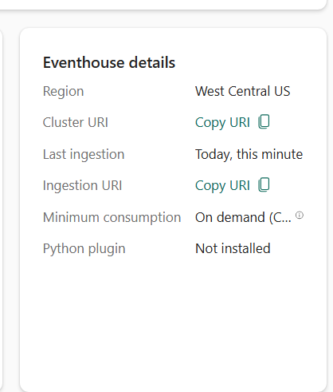
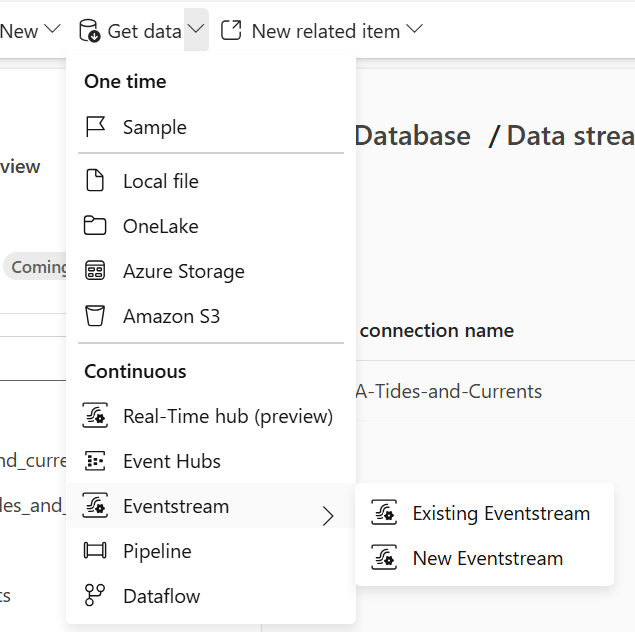
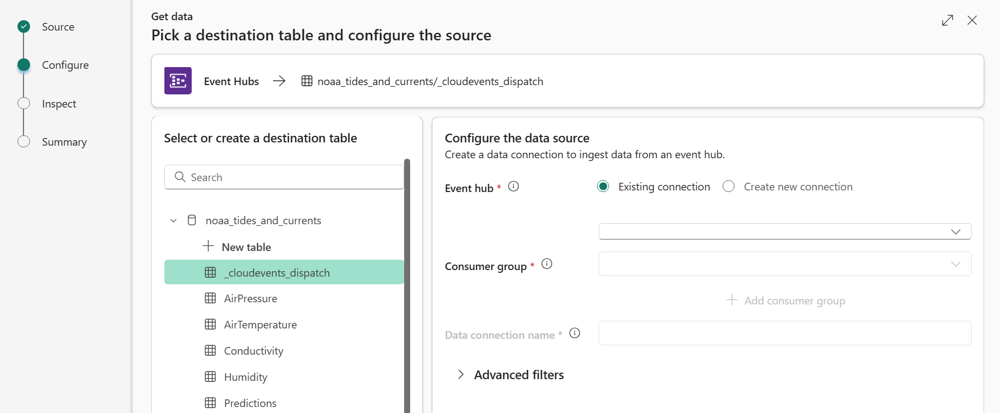
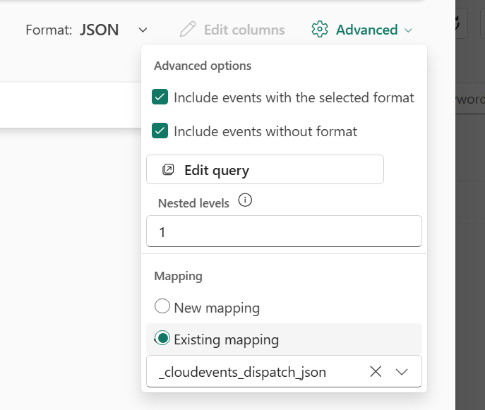

# API Bridges - Setting up a KQL database

The APi bridges write data to a Kafka topic or Azure Event Hubs
or Fabric Event Streams. From Event Hubs and Event Streams, you can easily feed
this data into a Fabric Eventhouse or Azure Data Explorer (Kusto) database to
analyze and visualize it.

This document explains how to set up a Kusto database and ingest data from the
API bridges. The principles are the same for all the bridges.

##  Creating the database - Microsoft Fabric Eventhouse

First, you need access to Microsoft Fabric. If you don't have access yet, you
can easily set up a trial account for yourself. To set up a trial account,
follow the instructions in the
[Microsoft Fabric documentation](https://learn.microsoft.com/en-us/fabric/get-started/fabric-trial).

If that's "TL;DR" for you, [click here and get going](https://app.fabric.microsoft.com/home).

To set up a KQL database in Microsoft Fabric, follow the following steps:

1. [Create an Eventhouse](https://learn.microsoft.com/en-us/fabric/real-time-intelligence/create-eventhouse) or reuse an existing one.
2. [Create a KQL database](https://learn.microsoft.com/en-us/fabric/real-time-intelligence/create-database) in the Eventhouse.

Once you have set up the KQL database, collect these two pieces of information:

1. The `databaseName` of the KQL database. 
2. The `clusterUri` of the Eventhouse. You can find this in the Eventhouse
   overview in the Microsoft Fabric portal under "Eventhouse details".

   

## Creating the database - Azure Data Explorer (Kusto)

First, you need an Azure subscription. If you don't have an Azure subscription
yet, you can easily set up a trial account for yourself. To set up a trial
account, follow the instructions in the
[Azure documentation](https://azure.microsoft.com/en-us/free/).

To set up a KQL database in Azure Data Explorer (Kusto), follow the steps in the [Create a Kusto cluster and database](https://docs.microsoft.com/en-us/azure/data-explorer/create-cluster-database-portal) article.

Once you have set up the KQL database, collect these two pieces of information:

1. The `databaseName` of the KQL database.
2. The `clusterUri` of the Kusto cluster. You can find this in the Azure portal
   under "Overview" in the Azure Data Explorer (Kusto) resource. It's the value
   of the "URI" field.

## Adding the event data schemas to the KQL database

The KQL scripts in the projects contains the necessary table schemas,
materialized views, and update policies to organize the event
data in the the KQL database. Consider this your "bronze" layer.

The scripts are located here:
- GTFS: [gtfs.kql](gtfs/kql/gtfs.kql)
- NOAA: [noaa.kql](noaa/kql/noaa.kql)
- PegelOnline: [pegelonline.kql](pegelonline/kql/pegelonline.kql)
- RSS: [rss.kql](rss/kql/feeds.kql)

You can run the script one-by-one in the Kusto Query Language (KQL) editor in
the Fabric or Azure database portal, or you can use the `kusto.cli` tool for
which you find two helper scripts in the [tools](tools) directory.

### Installing the Kusto CLI tool

To install the Kusto CLI tool, run the following command:

```shell
.\tools\install-kusto-cli.ps1
```

The script downloads the Kusto CLI tool, installs it into the `KustoCLI` directory of your user profile, and adds tools directory inside of that to the user's PATH. If you run the tool from Windows Powershell, the .NET 4.7 version is installed, if you run from Powershell 7+, the .NET 6.0 version is installed.

### Running the KQL script

To run the KQL script, use the following command:

```shell
.\tools\run-kql-script.ps1 -clusterUri '<clusterUri>' -databaseName '<databaseName>' -script .\gtfs\kql\gtfs.kql
```

Replace `<clusterUri>` and `<databaseName>` with the values you collected earlier.

This assumes that you run the script from the root of the repository. If you run it from a different location, adjust the path to the script accordingly.

### The schema and how it works

The script creates a table for each payload schema of every event that is being
sent by the bridge. The table contains the "top level" fields of the payload
schema flattened into columns. If a payload field is an object or an array, the
column type is `dynamic`. The CloudEvents metadata is stored in the table as
well, with each attribute name prefixed with `___`.

Example:

```kusto
.create-merge table [Trips] (
   [routeId]: string,
   [serviceDates]: dynamic,
   [serviceExceptions]: dynamic,
   [tripId]: string,
   [tripHeadsign]: string,
   [tripShortName]: string,
   [directionId]: string,
   [blockId]: string,
   [shapeId]: string,
   [wheelchairAccessible]: string,
   [bikesAllowed]: string,
   [___type]: string,
   [___source]: string,
   [___id]: string,
   [___time]: datetime,
   [___subject]: string
);
```

The script also creates a materialized view for each payload schema that gives
you the latest event for each unique combination of the CloudEvent `___type`,
`___source`, and `___subject`. This is useful for querying the latest state of
each entity. The bridge will generally populate the `___subject` with a key
value for the entity (the `tripId` in the example above), so you can easily
query the latest state and avoid reading duplicates in the form of older
versions.

```kusto
.create materialized-view with (backfill=true) TripsLatest on table Trips {
    Trips | summarize arg_max(___time, *) by ___type, ___source, ___subject
}
```

You will also find that the input schema's descriptive metadata is added
to the table as table and column docstrings.

Inside the docstrings you may find two fields:

- `description`: A human-readable description of the field.
- `schema`: An Apache Avro schema that describes the field's data type and possible values. This is added if the available type information is richer than what can be expressed in KQL.

Example:

``` kusto
.alter table [Trips] column-docstrings (
   [routeId]: "{\"description\": \"Identifies a route.\"}",
   [tripId]: "{\"description\": \"Identifies a trip.\"}",
   [tripHeadsign]: "{\"description\": \"Text that appears on signage identifying the trip's destination to riders.\", \"schema\": [\"null\", \"string\"]}",
   [tripShortName]: "{\"description\": \"Public facing text used to identify the trip to riders.\", \"schema\": [\"null\", \"string\"]}",
   [directionId]: "{\"description\": \"Indicates the direction of travel for a trip.\", \"schema\": {\"type\": \"enum\", \"name\": \"DirectionId\", \"namespace\": \"GeneralTransitFeedStatic\", \"symbols\": [\"OUTBOUND\", \"INBOUND\"], \"doc\": \"Indicates the direction of travel for a trip. Symbols: OUTBOUND - Travel in one direction; INBOUND - Travel in the opposite direction.\"}}",
   [blockId]: "{\"description\": \"Identifies the block to which the trip belongs.\", \"schema\": [\"null\", \"string\"]}",
   [shapeId]: "{\"description\": \"Identifies a geospatial shape describing the vehicle travel path for a trip.\", \"schema\": [\"null\", \"string\"]}",
   [wheelchairAccessible]: "{\"description\": \"Indicates wheelchair accessibility.\", \"schema\": {\"type\": \"enum\", \"name\": \"WheelchairAccessible\", \"namespace\": \"GeneralTransitFeedStatic\", \"symbols\": [\"NO_INFO\", \"WHEELCHAIR_ACCESSIBLE\", \"NOT_WHEELCHAIR_ACCESSIBLE\"], \"doc\": \"Indicates wheelchair accessibility. Symbols: NO_INFO - No accessibility information for the trip; WHEELCHAIR_ACCESSIBLE - Vehicle can accommodate at least one rider in a wheelchair; NOT_WHEELCHAIR_ACCESSIBLE - No riders in wheelchairs can be accommodated on this trip.\"}}",
   [bikesAllowed]: "{\"description\": \"Indicates whether bikes are allowed.\", \"schema\": {\"type\": \"enum\", \"name\": \"BikesAllowed\", \"namespace\": \"GeneralTransitFeedStatic\", \"symbols\": [\"NO_INFO\", \"BICYCLE_ALLOWED\", \"BICYCLE_NOT_ALLOWED\"], \"doc\": \"Indicates whether bikes are allowed. Symbols: NO_INFO - No bike information for the trip; BICYCLE_ALLOWED - Vehicle can accommodate at least one bicycle; BICYCLE_NOT_ALLOWED - No bicycles are allowed on this trip.\"}}",
   [___type] : 'Event type',
   [___source]: 'Context origin/source of the event',
   [___id]: 'Event identifier',
   [___time]: 'Event generation time',
   [___subject]: 'Context subject of the event'
);
```

The script also creates an update policy for each table that imports "its" events from
the `_cloudevents_ingest` table. This is explained further in the next section.

````kusto
.alter table [Trips] policy update
```
[{
  "IsEnabled": true,
  "Source": "_cloudevents_dispatch",
  "Query": "_cloudevents_dispatch | where (specversion == '1.0' and type == 'GeneralTransitFeedStatic.Trips') | project['routeId'] = tostring(data.['routeId']),['serviceDates'] = todynamic(data.['serviceDates']),['serviceExceptions'] = todynamic(data.['serviceExceptions']),['tripId'] = tostring(data.['tripId']),['tripHeadsign'] = tostring(data.['tripHeadsign']),['tripShortName'] = tostring(data.['tripShortName']),['directionId'] = tostring(data.['directionId']),['blockId'] = tostring(data.['blockId']),['shapeId'] = tostring(data.['shapeId']),['wheelchairAccessible'] = tostring(data.['wheelchairAccessible']),['bikesAllowed'] = tostring(data.['bikesAllowed']),___type = type,___source = source,___id = ['id'],___time = ['time'],___subject = subject",
  "IsTransactional": false,
  "PropagateIngestionProperties": true,
}]
```
````

Finally, there are two ingestion mappings created for each table. The `_json_flat` mapping assumes that the
arriving events are already in the flattened form of the table schema. The `_json_ce_structured` mapping assumes that the arriving events are in CloudEvents structured JSON format and extracts the payload columns from the `data` field.


## Ingesting data from the API bridge

Now that you have set up the KQL database and added the necessary schemas, you
still need to wire up the API bridge to the KQL database.

The table schema elements added by the script allow for several avenues for
ingesting data. We will discuss two of them here:

### Ingesting events data via the `_cloudevents_dispatch` table.

In this scenario, you will set up your KQL database to ingest data from the
Event Stream or Event Hub into the `_cloudevents_dispatch` table, using the
`_cloudevents_dispatch_json` JSON ingestion mapping.

#### Setting up the ingestion in Microsoft Fabric

Before you start, the bridge should be running or should at least already have
run once to send some events to the target Event Stream or Event Hub. It is
required for data to be in the Event Stream or Event Hub to finish the setup.

1. In the Microsoft Fabric portal, navigate to the Eventhouse and database you
   set up.

2. Find the "Get Data" button in the ribbon, and click it or expand its menu.
   Select either "Event Hub" or "Event Stream" depending on which you are
   publishing to: <br>

3. In the "Pick a destination table and configure the source" dialog, select the
   `_cloudevents_dispatch` table, then complete the source configuration. <br>

   Detailed instructions for how to connect to Event Hubs and Event Streams sources can
   be found in the documentation:
   
   - [Get data from Azure Event Hubs](https://learn.microsoft.com/en-us/fabric/real-time-intelligence/get-data-event-hub)

   - [Get data from Azure Event Streams](https://learn.microsoft.com/en-us/fabric/real-time-intelligence/get-data-event-streams)

4. It is recommended to open up the "Advanced filters" section and set the
   "Event retrieval start date" to date well before you started the bridge for
   the first time.

5. Click "Next". On the upper right hand side of the "Inspect the data" dialog,
   make sure that "Format" is "JSON" and then click "Advanced", select "existing
   mapping" in the box and choose the `_cloudevents_dispatch_mapping` mapping.
   <br>

6. Click "Finish" to start the ingestion.

Once you've completed these steps, events will start showing up in the `_cloudevents_dispatch` table
and the update policies will take care of importing the events into the per-event-type tables.

#### Setting up the ingestion in Azure Data Explorer (Kusto)

With Azure Data Explorer, the steps are similar to the ones for Microsoft Fabric, but the 
portal entry point is different.

Follow the instructions in the
[Create an Event Hubs data connection for Azure Data Explorer](https://learn.microsoft.com/en-us/azure/data-explorer/create-event-hubs-connection?tabs=get-data%2Cget-data-2)
article, and select the table and mappings as described above.

### Ingesting directly into the event tables from Azure Stream Analytics

If you are using Azure Stream Analytics to pre-process the data from the Event Hub
or Event Stream, you can push the event data directly into the event tables.

1. In the Azure portal, navigate to the Azure Stream Analytics job that you have
   set up to process the data from the Event Hub or Event Stream.
2. In the job's "Overview" pane, click on the "Outputs" tab and add a new output
3. Select "Azure Data Explorer" as the output type.
4. Configure the output with the connection string of the Azure Data Explorer
   cluster and the database name.
5. In the "Table" field, enter the name of the event table you want to target.

In the "Query" field, you can use the `SELECT` statement to map the incoming
data to the table schema, filtered by `type`. For example:

```sql
SELECT
    data.*,
    type as ___type,
    source as ___source,
    id as ___id,
    time as ___time,
    subject as ___subject
INTO
    Trips
FROM
    input_stream
WHERE
    specversion = '1.0' AND type = 'GeneralTransitFeedStatic.Trips'
```

