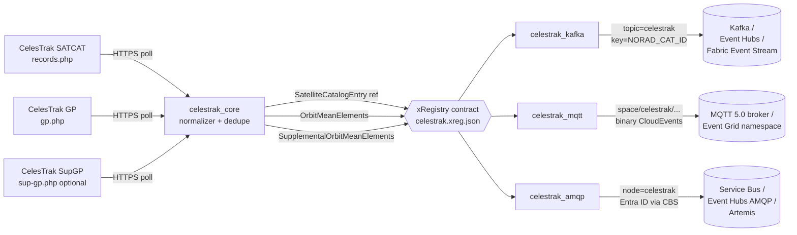

<!-- source-hero:begin -->
<table width="100%"><tr>
<td width="80" valign="middle" align="center">
<div style="font-size:48px">🛰️</div><br>
<sub><b>Space</b></sub>
</td>
<td valign="middle">

# CelesTrak

<sub>public satellite catalog and orbital elements · Kafka · MQTT · AMQP · <a href="https://celestrak.org/">upstream</a> · <a href="https://celestrak.org/NORAD/documentation/gp-data-formats.php">GP docs</a> · <a href="https://celestrak.org/satcat/">SATCAT docs</a></sub>

  
&nbsp;
  
&nbsp;
<a href="https://github.com/clemensv/real-time-sources/actions/workflows/build_containers.yml"></a>

> Space - public orbital data redistributed by CelesTrak

[🚀 **Deploy to Azure**](https://clemensv.github.io/real-time-sources#celestrak) &nbsp;·&nbsp;
[📓 **Fabric Notebook**](https://clemensv.github.io/real-time-sources#celestrak/fabric-notebook) &nbsp;·&nbsp;
[🐳 **docker pull**](CONTAINER.md) &nbsp;·&nbsp;
[📑 **Event schemas**](EVENTS.md) &nbsp;·&nbsp;
[🗄️ **KQL schema**](kql/celestrak.kql) &nbsp;·&nbsp;
[↗ **Upstream**](https://celestrak.org/)

</td></tr></table>
<!-- source-hero:end -->

# CelesTrak

[🚀 **Deploy to Azure**](https://clemensv.github.io/real-time-sources#celestrak) &nbsp;·&nbsp;
[📓 **Fabric Notebook**](https://clemensv.github.io/real-time-sources#celestrak/fabric-notebook) &nbsp;·&nbsp;
[🐳 **docker pull**](CONTAINER.md) &nbsp;·&nbsp;
[📑 **Event schemas**](EVENTS.md) &nbsp;·&nbsp;
[🗄️ **KQL schema**](kql/celestrak.kql) &nbsp;·&nbsp;
[↗ **Upstream**](https://celestrak.org/)

## At a glance

<table align="right">
<tr><td valign="middle">🌍</td><td valign="middle"><b>Region</b></td><td valign="middle">Space / orbital domain</td></tr>
<tr><td valign="middle">🏛️</td><td valign="middle"><b>Authority</b></td><td valign="middle"><a href="https://celestrak.org/">CelesTrak</a>, maintained by Dr. T.S. Kelso; data derived from the US Space Force public catalog</td></tr>
<tr><td valign="middle">📊</td><td valign="middle"><b>Coverage</b></td><td valign="middle">CelesTrak SATCAT, GP GROUP views, and optional SupGP sources</td></tr>
<tr><td valign="middle">⏱️</td><td valign="middle"><b>Cadence</b></td><td valign="middle">3600-second GP poll by default; 86400-second SATCAT refresh</td></tr>
<tr><td valign="middle">🔌</td><td valign="middle"><b>Transports</b></td><td valign="middle">Kafka · MQTT 5.0 · AMQP 1.0</td></tr>
<tr><td valign="middle">📍</td><td valign="middle"><b>Kafka key</b></td><td valign="middle"><code>{NORAD_CAT_ID}</code></td></tr>
<tr><td valign="middle">📦</td><td valign="middle"><b>Events</b></td><td valign="middle"><code>SatelliteCatalogEntry</code> · <code>OrbitMeanElements</code> · <code>SupplementalOrbitMeanElements</code></td></tr>
<tr><td valign="middle">📜</td><td valign="middle"><b>License</b></td><td valign="middle">Public orbital data redistributed by CelesTrak; derived from the US Space Force public catalog</td></tr>
<tr><td valign="middle">🔐</td><td valign="middle"><b>Auth</b></td><td valign="middle">None - keyless HTTPS JSON endpoints</td></tr>
</table>

The bridge turns the long-standing [CelesTrak](https://celestrak.org/) public orbital-data endpoints into a CloudEvents stream that consumers can subscribe to instead of polling SATCAT and GP JSON themselves. It handles conservative polling, reference-first startup, dedupe state, UTC epoch normalization, CloudEvents identity plumbing, retries, and three drop-in transport variants.

**Who uses it.** Space situational awareness dashboards; satellite operations and mission-planning teams that need fresh OMM element sets; ground-station and RF scheduling systems; orbital analytics and conjunction-screening pipelines; education and public visualizations; Fabric Eventhouse / ADX consumers that want a durable stream of satellite catalog context plus orbital telemetry.

CelesTrak data is publicly and freely available. CelesTrak asks users to be considerate of bandwidth, so this feeder defaults to a one-hour GP telemetry poll and a daily SATCAT reference refresh. No API key is required.

## 60-second quick start

```bash
docker run --rm \
  -v "$PWD/state:/state" \
  -e STATE_FILE=/state/celestrak.json \
  -e CONNECTION_STRING="Endpoint=sb://<ns>.servicebus.windows.net/;SharedAccessKeyName=...;SharedAccessKey=...;EntityPath=celestrak" \
  ghcr.io/clemensv/real-time-sources-celestrak-kafka:latest
```

That's it. The first cycle emits `SatelliteCatalogEntry` reference events for the configured SATCAT groups, then GP telemetry as `OrbitMeanElements` events. If `SUPGP_SOURCES` is set, the feeder also emits `SupplementalOrbitMeanElements` telemetry. Mount `./state` to persist dedupe across restarts.

MQTT and AMQP variants take the same form - see [CONTAINER.md](CONTAINER.md) for the per-transport env-var matrix.

## Architecture



All three variants share the upstream poller (`celestrak_core`), the xRegistry contract (`xreg/celestrak.xreg.json`), and the CloudEvents schemas - switching transport never changes the data model.

## Sample event

<details>
<summary><b><code>org.celestrak.OrbitMeanElements</code></b> - GP orbital element set (click to expand)</summary>

```json
{
  "specversion": "1.0",
  "type": "org.celestrak.OrbitMeanElements",
  "source": "https://celestrak.org/NORAD/elements/gp.php?GROUP=stations&FORMAT=json#25544",
  "id": "01985f6c-2f55-7c4f-9d2a-3a8e64c4e2a1",
  "time": "2026-07-15T18:23:37.536288Z",
  "subject": "25544",
  "datacontenttype": "application/json",
  "data": {
    "OBJECT_NAME": "ISS (ZARYA)",
    "OBJECT_ID": "1998-067A",
    "EPOCH": "2026-07-15T18:23:37.536288+00:00",
    "MEAN_MOTION": 15.49,
    "ECCENTRICITY": 0.0006,
    "INCLINATION": 51.64,
    "RA_OF_ASC_NODE": 12.34,
    "ARG_OF_PERICENTER": 98.76,
    "MEAN_ANOMALY": 261.24,
    "EPHEMERIS_TYPE": 0,
    "CLASSIFICATION_TYPE": "U",
    "NORAD_CAT_ID": 25544,
    "ELEMENT_SET_NO": 999,
    "REV_AT_EPOCH": 48231,
    "BSTAR": 0.000123,
    "MEAN_MOTION_DOT": 0.000064,
    "MEAN_MOTION_DDOT": 0.0
  }
}
```

The Kafka record carries the same CloudEvent in topic `celestrak`, and the Kafka key is `25544` (the `{NORAD_CAT_ID}` template). On MQTT the same JSON payload is published to `space/celestrak/gp/25544` with CloudEvents attributes as MQTT 5 user properties. On AMQP the same JSON is the application body on node `celestrak` with the CloudEvents attributes as `cloudEvents:*` application properties and the AMQP message subject set to `25544`.

See [EVENTS.md](EVENTS.md) for the full schemas of all three event types and the JsonStructure constraints.

</details>

## Transport variants

| Variant | Container image | Targets | Wire shape |
|---|---|---|---|
| **🟥 Kafka** | `ghcr.io/clemensv/real-time-sources-celestrak-kafka` | Apache Kafka 2.x · Azure Event Hubs · Fabric Event Streams · Confluent · Redpanda · Aiven · MSK | Single topic `celestrak`, CloudEvents, key = `{NORAD_CAT_ID}` |
| **🟪 MQTT** | `ghcr.io/clemensv/real-time-sources-celestrak-mqtt` | Mosquitto · EMQX · HiveMQ · Azure Event Grid namespace · Fabric Real-Time Hub MQTT broker | UNS tree `space/celestrak/{satcat|gp|supgp}/{NORAD_CAT_ID}`, binary CloudEvents as MQTT 5 user properties |
| **🟦 AMQP** | `ghcr.io/clemensv/real-time-sources-celestrak-amqp` | Azure Service Bus · Azure Event Hubs (AMQP surface) · ActiveMQ Artemis · Qpid · RabbitMQ AMQP 1.0 plugin | Single AMQP node `celestrak`, binary CloudEvents, SASL PLAIN, SAS, or Entra ID via AMQP CBS |

<!-- source-deploy:begin -->
## Deploy

The portal buttons wrap the underlying scripts and ARM templates documented below; pick the path that matches your destination and operational preference. Every route lands in the same Eventhouse / KQL schema if you want one - they only differ in where the feeder container or notebook runs.

### Deploying into Microsoft Fabric

CelesTrak targets Microsoft Fabric end-to-end: events land in a Fabric **Event Stream** (custom endpoint), and an attached **Eventhouse / KQL database** materializes the contract from [`kql/`](kql/) into typed tables for `org.celestrak.SatelliteCatalogEntry`, `org.celestrak.OrbitMeanElements`, and `org.celestrak.SupplementalOrbitMeanElements`.

Two hosting models are supported. Use the deploy buttons on the [project portal](https://clemensv.github.io/real-time-sources#celestrak) to launch either - both walk you through the same Fabric workspace selection and follow-up steps.

#### Fabric Notebook feeder &nbsp;<sub><i>(recommended for low-volume polling)</i></sub>

A scheduled Fabric Notebook in [`notebook/`](notebook/) runs the poller inside the Fabric workspace itself, against a per-source Fabric **Environment** that bundles the `celestrak` package and the generated producer sub-packages. The Event Stream custom-endpoint connection string is looked up at runtime via the public Fabric Topology API using the workspace identity - no secrets in the notebook, no separate container host to manage. Dedupe state lives in OneLake under `/lakehouse/default/Files/feeder-state/celestrak/`.

```powershell
tools/deploy-fabric/deploy-feeder-notebook.ps1 `
  -Source celestrak `
  -Workspace <fabric-workspace-id-or-name> `
  -ResourceGroup <azure-rg-for-bootstrap> `
  -Location <azure-region>
```

Best fit for poll-based sources whose update cadence aligns with scheduled execution; the notebook writes a per-run diagnostic log to OneLake on every run.

[](https://clemensv.github.io/real-time-sources#celestrak/fabric-notebook)

#### Fabric ACI feeder &nbsp;<sub><i>(recommended for high-volume / always-on, and for MQTT or AMQP)</i></sub>

A long-running Azure Container Instance hosts the container image and writes into a Fabric Event Stream custom endpoint. Use this for continuous polling, real-time MQTT/UNS publishing, or the AMQP transport - anything that does not fit a scheduled-notebook model.

```powershell
tools/deploy-fabric/deploy-fabric-aci.ps1 `
  -Source celestrak `
  -Workspace <fabric-workspace-id-or-name> `
  -ResourceGroup <azure-rg> `
  -Location <azure-region>
```

The script creates the Eventhouse, the KQL database with the [`kql/`](kql/) schema and update policies, the Event Stream with a custom endpoint, the ACI with the connection string wired in, and a storage account / file share mounted at `/state` for dedupe persistence.

[](https://clemensv.github.io/real-time-sources#celestrak/fabric-aci)

### Deploying into Azure Container Instances

One-click deployment templates are available for the common Azure targets. These templates host the container directly in Azure and target an Azure Event Hubs namespace, an MQTT broker, or an AMQP 1.0 peer. Templates that run the poller create a storage account and file share for persistent dedupe state.

#### Kafka - bring your own Event Hub / Kafka

Deploy the Kafka container with your own Azure Event Hubs or Fabric Event Stream connection string.

[](https://portal.azure.com/#create/Microsoft.Template/uri/https%3A%2F%2Fraw.githubusercontent.com%2Fclemensv%2Freal-time-sources%2Fmain%2Ffeeders%2Fcelestrak%2Fazure-template.json)

#### Kafka - provision a new Event Hub

Deploy the Kafka container together with a new Event Hubs namespace (Standard SKU, 1 throughput unit) and event hub.

[](https://portal.azure.com/#create/Microsoft.Template/uri/https%3A%2F%2Fraw.githubusercontent.com%2Fclemensv%2Freal-time-sources%2Fmain%2Ffeeders%2Fcelestrak%2Fazure-template-with-eventhub.json)

#### MQTT - bring your own broker

Deploy the MQTT container against an existing MQTT 5 broker. You provide the `mqtts://` URL and optional credentials.

[](https://portal.azure.com/#create/Microsoft.Template/uri/https%3A%2F%2Fraw.githubusercontent.com%2Fclemensv%2Freal-time-sources%2Fmain%2Ffeeders%2Fcelestrak%2Fazure-template-mqtt.json)

#### MQTT - provision a new Event Grid namespace MQTT broker

Deploy the MQTT container together with a new [Azure Event Grid namespace](https://learn.microsoft.com/azure/event-grid/mqtt-overview) with the MQTT broker enabled, a topic space rooted at `space/#`, a user-assigned managed identity, and the **EventGrid TopicSpaces Publisher** role assignment.

[](https://portal.azure.com/#create/Microsoft.Template/uri/https%3A%2F%2Fraw.githubusercontent.com%2Fclemensv%2Freal-time-sources%2Fmain%2Ffeeders%2Fcelestrak%2Fazure-template-with-eventgrid-mqtt.json)

#### AMQP - bring your own broker

Deploy the AMQP container against an existing AMQP 1.0 broker.

[](https://portal.azure.com/#create/Microsoft.Template/uri/https%3A%2F%2Fraw.githubusercontent.com%2Fclemensv%2Freal-time-sources%2Fmain%2Ffeeders%2Fcelestrak%2Fazure-template-amqp.json)

#### AMQP - provision a new Azure Service Bus namespace

Deploy the AMQP container together with a new [Azure Service Bus Standard namespace](https://learn.microsoft.com/azure/service-bus-messaging/service-bus-messaging-overview) with a queue named `celestrak`, a user-assigned managed identity, and the **Azure Service Bus Data Sender** role assignment.

[](https://portal.azure.com/#create/Microsoft.Template/uri/https%3A%2F%2Fraw.githubusercontent.com%2Fclemensv%2Freal-time-sources%2Fmain%2Ffeeders%2Fcelestrak%2Fazure-template-with-servicebus.json)

### Self-hosted

Pull and run any of the 3 container images directly - laptop, Kubernetes, Azure Container Apps, Cloud Run, ECS, bare metal. The full per-transport / per-auth-mode environment-variable matrix and sample `docker run` commands for every target broker live in [CONTAINER.md](CONTAINER.md).
<!-- source-deploy:end -->

## Configuration

<details>
<summary>Full environment-variable reference (click to expand)</summary>

| Variable | Variant | Purpose | Default |
|---|---|---|---|
| `CELESTRAK_GROUPS` | all | Comma/space-separated CelesTrak GROUP views to poll (`stations`, `active`, `starlink`, `visual`, ...). | `stations` |
| `SUPGP_SOURCES` | all | Comma/space-separated Supplemental GP sources to fetch (`SpaceX`, `Planet`, `OneWeb`, ...); empty disables SupGP. | empty |
| `POLLING_INTERVAL` | all | Seconds between GP telemetry poll cycles. | `3600` |
| `REFERENCE_REFRESH_INTERVAL` | all | Seconds between SATCAT reference-catalog re-fetch and re-emit cycles. | `86400` |
| `STATE_FILE` | all | Path to dedupe/watermark state file (mount a volume!). | `~/.celestrak_state.json` |
| `ONCE_MODE` | all | Run a single poll cycle and exit (for cron/Fabric notebook/Docker E2E). | `false` |
| `CONNECTION_STRING` | Kafka | Kafka/Event Hubs/Fabric Event Stream connection string, or `BootstrapServer=...;EntityPath=...`. | required |
| `KAFKA_ENABLE_TLS` | Kafka | `false` disables TLS for plaintext brokers. | `true` |
| `MQTT_BROKER_URL` | MQTT | `mqtts://host:8883` or `mqtt://host:1883`. | required |
| `MQTT_AUTH_MODE` | MQTT | `password` or `entra` for Event Grid namespace MQTT. | `password` |
| `AMQP_BROKER_URL` | AMQP | `amqp[s]://[user[:pass]@]host[:port]/<entity>`. | optional if `AMQP_HOST` is set |
| `AMQP_ADDRESS` | AMQP | AMQP queue/topic/address. | `celestrak` |
| `AMQP_AUTH_MODE` | AMQP | `password`, `entra`, or `sas`. | `password` |

The full per-deployment-shape env-var matrix lives in [CONTAINER.md](CONTAINER.md). The runtime entry point for every image is `python -m celestrak_kafka feed`, `python -m celestrak_mqtt feed`, or `python -m celestrak_amqp feed`; the image's default `CMD` invokes it for you.

</details>

## Data model

Three event types, all in namespace `org.celestrak`:

- **`SatelliteCatalogEntry`** - reference event, emitted at startup and on periodic reference refresh. Carries `OBJECT_NAME`, `OBJECT_ID`, `NORAD_CAT_ID`, object type/status/owner, launch and decay fields, launch site, orbit center/type, and coarse orbital summary fields. Subject: `{NORAD_CAT_ID}`.
- **`OrbitMeanElements`** - telemetry event, emitted when standard GP element sets change. Carries OMM mean Keplerian elements at `EPOCH`, SGP4 support fields, B*, mean-motion derivatives, and the `NORAD_CAT_ID` identity. Subject: `{NORAD_CAT_ID}`.
- **`SupplementalOrbitMeanElements`** - optional telemetry event, emitted when `SUPGP_SOURCES` is configured. Same core OMM element fields as `OrbitMeanElements`, plus `RMS` and `DATA_SOURCE` provenance. Subject: `{NORAD_CAT_ID}`.

All events are keyed by `{NORAD_CAT_ID}` so a consumer joining a `SatelliteCatalogEntry`-keyed table with GP/SupGP telemetry streams always sees temporally consistent object metadata for each element set - see [Streamifying reference data for temporal consistency with telemetry events](https://vasters.com/clemens/2024/10/30/streamifying-reference-data-for-temporal-consistency-with-telemetry-events) for the design rationale.

The complete JsonStructure schemas (with units, validation constraints, and Avro round-trip) are in [EVENTS.md](EVENTS.md).

## Repository layout

```text
celestrak/
├── xreg/celestrak.xreg.json              # shared xRegistry contract
├── celestrak_core/                       # transport-agnostic poller + normalizer
├── celestrak_kafka/                      # Kafka feeder application
├── celestrak_mqtt/                       # MQTT/UNS feeder application
├── celestrak_amqp/                       # AMQP 1.0 feeder application
├── celestrak_producer/                   # xRegistry-generated Kafka producer
├── celestrak_mqtt_producer/              # xRegistry-generated MQTT producer
├── celestrak_amqp_producer/              # xRegistry-generated AMQP producer
├── kql/celestrak.kql                     # Eventhouse table + update policies
├── notebook/celestrak-feed.ipynb         # Fabric Notebook feeder
├── Dockerfile.kafka                      # builds the Kafka feeder image
├── Dockerfile.mqtt                       # builds the MQTT feeder image
├── Dockerfile.amqp                       # builds the AMQP feeder image
└── tests/                                # unit + integration tests
```

## Prerequisites (for self-hosted runs)

- Docker 20.10+ (or any OCI-compatible runtime).
- Outbound HTTPS to `https://celestrak.org`; no API key is required.
- Network access to your target Kafka broker, MQTT broker, or AMQP 1.0 peer.
- A writable host directory mounted at `/state` so dedupe state survives restarts. **Without it, dedupe restarts cold on every container start.**
- Operators should keep the default conservative cadence unless they have a specific operational reason to poll faster.

---

<sub>
📚 <a href="../README.md">← Back to catalog</a> &nbsp;·&nbsp;
🌐 <a href="https://clemensv.github.io/real-time-sources/#celestrak">Portal entry</a> &nbsp;·&nbsp;
📑 <a href="EVENTS.md">EVENTS.md</a> &nbsp;·&nbsp;
🐳 <a href="CONTAINER.md">CONTAINER.md</a> &nbsp;·&nbsp;
🗄️ <a href="kql/celestrak.kql">KQL schema</a> &nbsp;·&nbsp;
↗ <a href="https://celestrak.org/">CelesTrak</a> &nbsp;·&nbsp;
📖 <a href="https://celestrak.org/NORAD/documentation/gp-data-formats.php">GP docs</a>
</sub>
