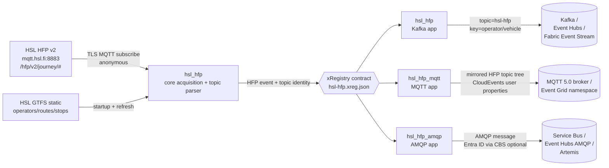

<!-- source-hero:begin -->

<!-- upstream-links:begin -->
## Upstream

- Home page: <https://www.hsl.fi/en/hsl/open-data>
- API / data documentation: <https://digitransit.fi/en/developers/apis/4-realtime-api/vehicle-positions/>

<!-- upstream-links:end -->

<table width="100%"><tr>
<td width="80" valign="middle" align="center">
<br>
<sub><b>Finland / Helsinki</b></sub>
</td>
<td valign="middle">

# HSL HFP

<sub>transit vehicle positions via MQTT, ~1,700 vehicles @ 1 Hz · Kafka · MQTT · AMQP · <a href="https://www.hsl.fi/en/hsl/open-data">upstream</a> · <a href="https://digitransit.fi/en/developers/apis/4-realtime-api/vehicle-positions/">API docs</a></sub>

  
&nbsp;
  
&nbsp;
<a href="https://github.com/clemensv/real-time-sources/actions/workflows/build_containers.yml"></a>

> Finland / Helsinki — transit vehicle positions via MQTT, ~1,700 vehicles @ 1 Hz

[🚀 **Deploy to Azure**](https://clemensv.github.io/real-time-sources#hsl-hfp) &nbsp;·&nbsp;
[🐳 **docker pull**](CONTAINER.md) &nbsp;·&nbsp;
[📑 **Event schemas**](EVENTS.md) &nbsp;·&nbsp;
[🗄️ **KQL schema**](kql/hsl-hfp.kql) &nbsp;·&nbsp;
[🗺️ **Fabric Map**](fabric/README.md) &nbsp;·&nbsp;
[↗ **Upstream**](https://www.hsl.fi/en/hsl/open-data)

</td></tr></table>
<!-- source-hero:end -->

This feeder subscribes to the anonymous public HSL High-Frequency Positioning (HFP) v2 MQTT firehose and re-emits the same journey topic structure and JSON payloads as CloudEvents over Kafka, MQTT, and AMQP 1.0. It is a transport bridge, not a transformer: the upstream HFP event shape is preserved so consumers can move from the public MQTT feed to their own broker without relearning the data model.

## At a glance

<table align="right">
<tr><td valign="middle">🌍</td><td valign="middle"><b>Region</b></td><td valign="middle">🇫🇮 Helsinki region, Finland</td></tr>
<tr><td valign="middle">🏛️</td><td valign="middle"><b>Authority</b></td><td valign="middle"><a href="https://www.hsl.fi/en/hsl/open-data">HSL — Helsinki Region Transport</a></td></tr>
<tr><td valign="middle">📡</td><td valign="middle"><b>Upstream</b></td><td valign="middle">HFP v2 public MQTT at <code>mqtt.hsl.fi:8883</code>, topic <code>/hfp/v2/journey/#</code></td></tr>
<tr><td valign="middle">🔌</td><td valign="middle"><b>Transports</b></td><td valign="middle">Kafka · MQTT 5.0 · AMQP 1.0</td></tr>
<tr><td valign="middle">📍</td><td valign="middle"><b>Identity / key</b></td><td valign="middle">Telemetry <code>{operator_id}/{vehicle_number}</code>; reference <code>operator/{operator_id}</code>, <code>route/{route_id}</code>, <code>stop/{stop_id}</code></td></tr>
<tr><td valign="middle">⏱️</td><td valign="middle"><b>Cadence</b></td><td valign="middle">Streaming — ~1 Hz per vehicle, no polling loop</td></tr>
<tr><td valign="middle">📈</td><td valign="middle"><b>Volume</b></td><td valign="middle">~950–1,700 messages/s, ~1,700 vehicles</td></tr>
<tr><td valign="middle">📦</td><td valign="middle"><b>Reference data</b></td><td valign="middle">GTFS <code>Operator</code>, <code>Route</code>, <code>Stop</code> at startup and every 12 h by default</td></tr>
<tr><td valign="middle">📜</td><td valign="middle"><b>License</b></td><td valign="middle"><a href="https://creativecommons.org/licenses/by/4.0/">CC BY 4.0</a> (Digitransit / HSL open data)</td></tr>
<tr><td valign="middle">🔐</td><td valign="middle"><b>Auth</b></td><td valign="middle">None upstream — public TLS MQTT</td></tr>
</table>

HSL HFP is the live vehicle-position firehose for the Helsinki public-transport network. The bridge subscribes to the public TLS MQTT broker, unwraps each HFP single-key payload only far enough to put it into a CloudEvent, injects the topic identity into the data object, and republishes the event to the transport you operate.

**Who uses it.** Transit operations dashboards, passenger-information backends, disruption analytics, signal-priority studies, vehicle-utilization reports, and Real-Time Intelligence pipelines that need the HSL feed on Kafka, MQTT, AMQP, Event Hubs, Service Bus, or Fabric Event Streams instead of directly consuming the public broker.

## Quick start

```bash
docker run --rm \
  -e CONNECTION_STRING="Endpoint=sb://<ns>.servicebus.windows.net/;SharedAccessKeyName=...;SharedAccessKey=...;EntityPath=hsl-hfp" \
  ghcr.io/clemensv/real-time-sources-hsl-hfp-kafka:latest
```

That's it. The process emits GTFS operator, route, and stop reference events first, then continuously fans out HFP telemetry from `mqtt.hsl.fi:8883`. No persistent dedupe state is required: this is a streaming pass-through bridge, and reference data is re-emitted on the refresh timer.

MQTT and AMQP variants take the same upstream configuration and publish to their own target brokers — see [CONTAINER.md](CONTAINER.md) for the full per-transport env-var matrix.

## Architecture



All three variants share the acquisition core (`hsl_hfp`), the upstream topic parser (`parse_topic`), the mapping layer, the GTFS reference refresh logic, and the xRegistry contract. Each container process publishes to exactly one downstream transport.

## Sample event

<details>
<summary><b><code>fi.hsl.hfp.vp</code></b> — vehicle-position CloudEvent (click to expand)</summary>

```json
{
  "specversion": "1.0",
  "type": "fi.hsl.hfp.vp",
  "source": "mqtts://mqtt.hsl.fi:8883/hfp/v2/journey",
  "id": "01985f6c-2f55-7c4f-9d2a-3a8e64c4e2a1",
  "time": "2026-06-29T00:03:45Z",
  "subject": "0055/01216",
  "datacontenttype": "application/json",
  "data": {
    "operator_id": "0055",
    "vehicle_number": "01216",
    "temporal_type": "ongoing",
    "transport_mode": "bus",
    "route_id": "1055",
    "direction_id": "1",
    "headsign": "Rautatientori",
    "start_time": "23:42",
    "next_stop": "H1234",
    "geohash_level": "4",
    "geohash": "60;24/19/73/44",
    "oper": 55,
    "veh": 1216,
    "tst": "2026-06-28T22:03:45.000Z",
    "tsi": 1782684225,
    "desi": "55",
    "dir": "1",
    "dl": 0,
    "oday": "2026-06-29",
    "jrn": 214,
    "line": 1055,
    "start": "23:42",
    "stop": "H1234",
    "route": "1055",
    "occu": 0,
    "seq": 17,
    "label": "1216",
    "spd": 11.8,
    "hdg": 274,
    "lat": 60.1698,
    "long": 24.9384,
    "acc": 0.1,
    "odo": 34812,
    "drst": 0,
    "loc": "GPS",
    "ttarr": null,
    "ttdep": null,
    "dr-type": null
  }
}
```

The Kafka record carries the same CloudEvent JSON in structured mode by default and the Kafka key is `0055/01216` (the `{operator_id}/{vehicle_number}` template). On MQTT the telemetry topic mirrors the upstream HFP journey topic tree. On AMQP the same data is the application body with CloudEvents attributes on AMQP message properties.

</details>

## Transport variants

| Variant | Container image | Content mode | Target brokers |
|---|---|---|---|
| **🟥 Kafka** | `ghcr.io/clemensv/real-time-sources-hsl-hfp-kafka` | Structured CloudEvents by default (`CONTENT_MODE=structured`) | Apache Kafka 2.x · Azure Event Hubs · Fabric Event Streams · Confluent · Redpanda · Aiven · MSK |
| **🟪 MQTT** | `ghcr.io/clemensv/real-time-sources-hsl-hfp-mqtt` | Binary CloudEvents by default (`MQTT_CONTENT_MODE=binary`) | Mosquitto · EMQX · HiveMQ · Azure Event Grid namespace · Fabric Real-Time Hub MQTT broker |
| **🟦 AMQP** | `ghcr.io/clemensv/real-time-sources-hsl-hfp-amqp` | Binary CloudEvents by default (`AMQP_CONTENT_MODE=binary`) | Azure Service Bus · Azure Event Hubs AMQP surface · ActiveMQ Artemis · Qpid Dispatch · RabbitMQ AMQP 1.0 plugin |

<!-- source-deploy:begin -->
## Deploy

The portal buttons wrap the underlying scripts and ARM templates documented below; pick the path that matches your destination and operational preference. Every route lands in the same Eventhouse / KQL schema if you want one — they only differ in where the feeder container or notebook runs.

### Deploying into Microsoft Fabric

HSL HFP targets Microsoft Fabric end-to-end: events land in a Fabric **Event Stream** (custom endpoint), an attached **Eventhouse / KQL database** materializes the contract from [`kql/`](kql/), and the bundled [**Fabric Map**](fabric/README.md) visualizes the live fleet on a basemap — ~1,700 vehicles colored by transport mode, the HSL stop network, and optional punctuality, density, and traffic-signal-priority overlays.

Use the deploy button on the [project portal](https://clemensv.github.io/real-time-sources#hsl-hfp) to launch the Fabric ACI hosting model — it walks you through Fabric workspace selection and follow-up steps.

#### Fabric ACI feeder &nbsp;<sub><i>(continuous container hosting against a Fabric Event Stream)</i></sub>

A long-running Azure Container Instance hosts the container image and writes into a Fabric Event Stream custom endpoint. Use this for continuous polling, real-time MQTT/UNS publishing, or the AMQP transport — anything that does not fit a scheduled-notebook model.

```powershell
tools/deploy-fabric/deploy-fabric-aci.ps1 `
  -Source hsl-hfp `
  -Workspace <fabric-workspace-id-or-name> `
  -ResourceGroup <azure-rg> `
  -Location <azure-region>
```

The script creates the Eventhouse, the KQL database with the [`kql/`](kql/) schema and update policies, the Event Stream with a custom endpoint, the ACI with the connection string wired in, and a storage account / file share mounted at `/state` for dedupe persistence. As a final step it runs the [`fabric/`](fabric/README.md) post-deploy hook, which creates the **`hsl-hfp-map`** Map item and wires its live vehicle, stop, punctuality, density, and signal-priority layers.

[](https://clemensv.github.io/real-time-sources#hsl-hfp/fabric-aci)


### Deploying into Azure Container Instances

5 one-click deployment templates — one per realistic Azure target. These templates host the container directly in Azure (without a Fabric workspace) and target an Azure Event Hubs namespace, an MQTT broker, or an AMQP 1.0 peer. All templates create a storage account and file share for persistent dedupe state.

#### Kafka — bring your own Event Hub / Kafka

Deploy the Kafka container with your own Azure Event Hubs or Fabric Event Stream connection string. You pass the connection string at deploy time; the template provisions only the container and a storage account for persistent dedupe state.

[](https://portal.azure.com/#create/Microsoft.Template/uri/https%3A%2F%2Fraw.githubusercontent.com%2Fclemensv%2Freal-time-sources%2Fmain%2Ffeeders%2Fhsl-hfp%2Fazure-template.json)

#### Kafka — provision a new Event Hub

Deploy the Kafka container together with a new Event Hubs namespace (Standard SKU, 1 throughput unit) and event hub. The connection string is wired automatically.

[](https://portal.azure.com/#create/Microsoft.Template/uri/https%3A%2F%2Fraw.githubusercontent.com%2Fclemensv%2Freal-time-sources%2Fmain%2Ffeeders%2Fhsl-hfp%2Fazure-template-with-eventhub.json)

#### MQTT — bring your own broker

Deploy the MQTT container against an existing MQTT 5 broker (Mosquitto, EMQX, HiveMQ, Azure Event Grid namespace MQTT, etc.). You provide the `mqtts://` URL and optional credentials.

[](https://portal.azure.com/#create/Microsoft.Template/uri/https%3A%2F%2Fraw.githubusercontent.com%2Fclemensv%2Freal-time-sources%2Fmain%2Ffeeders%2Fhsl-hfp%2Fazure-template-mqtt.json)

#### MQTT — provision a new Event Grid namespace MQTT broker

Deploy the MQTT container together with a new [Azure Event Grid namespace](https://learn.microsoft.com/azure/event-grid/mqtt-overview) with the MQTT broker enabled, a topic space for this source, a user-assigned managed identity, and the **EventGrid TopicSpaces Publisher** role assignment. The feeder authenticates with MQTT v5 enhanced authentication (`OAUTH2-JWT`) — no shared keys to rotate.

[](https://portal.azure.com/#create/Microsoft.Template/uri/https%3A%2F%2Fraw.githubusercontent.com%2Fclemensv%2Freal-time-sources%2Fmain%2Ffeeders%2Fhsl-hfp%2Fazure-template-with-eventgrid-mqtt.json)

#### AMQP — provision a new Azure Service Bus namespace

Deploy the AMQP container together with a new [Azure Service Bus Standard namespace](https://learn.microsoft.com/azure/service-bus-messaging/service-bus-messaging-overview) with a queue, a user-assigned managed identity, and the **Azure Service Bus Data Sender** role assignment. The feeder authenticates via AMQP CBS put-token with Microsoft Entra ID — no SAS key rotation required.

[](https://portal.azure.com/#create/Microsoft.Template/uri/https%3A%2F%2Fraw.githubusercontent.com%2Fclemensv%2Freal-time-sources%2Fmain%2Ffeeders%2Fhsl-hfp%2Fazure-template-with-servicebus.json)


### Self-hosted

Pull and run any of the 3 container images directly — laptop, Kubernetes, Azure Container Apps, Cloud Run, ECS, bare metal. The full per-transport / per-auth-mode environment-variable matrix and sample `docker run` commands for every target broker live in [CONTAINER.md](CONTAINER.md).
<!-- source-deploy:end -->
## Configuration

<details>
<summary>Full environment-variable reference (click to expand)</summary>

### Upstream HFP MQTT subscription

| Variable | Variant | Purpose | Default |
|---|---|---|---|
| `HFP_MQTT_HOST` | all | Upstream HSL HFP broker host. | `mqtt.hsl.fi` |
| `HFP_MQTT_PORT` | all | Upstream HSL HFP broker port. | `8883` |
| `HFP_MQTT_TLS` | all | Use TLS for the upstream MQTT connection; set `false`, `0`, or `no` only for tests. | `true` |
| `HFP_TOPIC_FILTERS` | all | Comma-separated HFP topic filters. Use this to narrow by temporal type, event type, mode, route, operator, or vehicle. | `/hfp/v2/journey/#` |

### Reference data

| Variable | Variant | Purpose | Default |
|---|---|---|---|
| `REFERENCE_REFRESH_INTERVAL` | all | Seconds between GTFS operator/route/stop refreshes. `0` disables periodic refresh after startup. | `43200` |
| `SKIP_REFERENCE` | all | Set `true`, `1`, or `yes` to skip the GTFS download and emit telemetry only. | `false` |
| `HSL_GTFS_URL` | all | HSL GTFS static ZIP used for `Operator`, `Route`, and `Stop` reference events. | `https://infopalvelut.storage.hsldev.com/gtfs/hsl.zip` |

### Run mode

| Variable | Variant | Purpose | Default |
|---|---|---|---|
| `ONCE_MODE` | all | Emit reference data and a bounded telemetry sample, then exit. Useful for smoke tests and Docker E2E. | `false` |
| `ONCE_MAX_EVENTS` | all | Maximum telemetry messages in once mode. | `50` |
| `ONCE_MAX_SECONDS` | all | Maximum seconds to wait in once mode. | `60` |
| `LOG_LEVEL` | all | Python logging level (`DEBUG`, `INFO`, `WARNING`, `ERROR`). | `INFO` |

### Kafka image

| Variable | Variant | Purpose | Default |
|---|---|---|---|
| `CONNECTION_STRING` | Kafka | Event Hubs / Fabric Event Stream connection string, or `BootstrapServer=...;EntityPath=...` for plain Kafka test harnesses. Supersedes direct broker settings. | unset |
| `KAFKA_BOOTSTRAP_SERVERS` | Kafka | Comma-separated `host:port` Kafka bootstrap list when not using `CONNECTION_STRING`. | required unless `CONNECTION_STRING` is set |
| `KAFKA_TOPIC` | Kafka | Target Kafka topic. Use `hsl-hfp` to match the xRegistry contract. | required unless `EntityPath` is in `CONNECTION_STRING` |
| `SASL_USERNAME` / `SASL_PASSWORD` | Kafka | SASL PLAIN credentials for Kafka-compatible brokers. | optional |
| `KAFKA_ENABLE_TLS` | Kafka | `false` disables TLS for direct broker mode. | `true` |
| `CONTENT_MODE` | Kafka | CloudEvents mode: `structured` or `binary`. | `structured` |

### MQTT image

| Variable | Variant | Purpose | Default |
|---|---|---|---|
| `MQTT_BROKER_URL` | MQTT | Downstream broker URL, e.g. `mqtt://host:1883` or `mqtts://host:8883`. | `mqtt://localhost:1883` |
| `MQTT_USERNAME` / `MQTT_PASSWORD` | MQTT | Optional username/password for generic brokers when `MQTT_AUTH_MODE=password`. | optional |
| `MQTT_CLIENT_ID` | MQTT | MQTT client identifier; required for Azure Event Grid namespace Entra auth. | optional |
| `MQTT_CONTENT_MODE` | MQTT | CloudEvents mode: `binary` or `structured`. | `binary` |
| `MQTT_AUTH_MODE` | MQTT | `password` for generic username/password or anonymous brokers; `entra` for MQTT v5 enhanced auth with Microsoft Entra ID. | `password` |
| `MQTT_ENTRA_AUDIENCE` | MQTT | Token audience for `MQTT_AUTH_MODE=entra`. | `https://eventgrid.azure.net/` |
| `MQTT_ENTRA_CLIENT_ID` | MQTT | Optional user-assigned managed-identity client id. | optional |
| `MQTT_CA_FILE` | MQTT | Optional CA bundle for verifying the downstream broker certificate. | optional |

### AMQP image

| Variable | Variant | Purpose | Default |
|---|---|---|---|
| `AMQP_BROKER_URL` | AMQP | Full broker URL, e.g. `amqp://user:pw@host:5672/hsl-hfp` or `amqps://host:5671/hsl-hfp`. | unset |
| `AMQP_HOST` | AMQP | Broker host when not using `AMQP_BROKER_URL`. | required unless `AMQP_BROKER_URL` is set |
| `AMQP_PORT` | AMQP | Broker port. Use `5671` with TLS for Azure Service Bus / Event Hubs. | transport default |
| `AMQP_ADDRESS` | AMQP | Queue, topic, event hub, or AMQP node address. | `hsl-hfp` |
| `AMQP_USERNAME` / `AMQP_PASSWORD` | AMQP | SASL PLAIN credentials for `AMQP_AUTH_MODE=password`. | optional |
| `AMQP_TLS` | AMQP | Set `true` to use TLS for component-level `AMQP_HOST` / `AMQP_PORT` settings. | `false` |
| `AMQP_CONTENT_MODE` | AMQP | CloudEvents mode: `binary` or `structured`. | `binary` |
| `AMQP_AUTH_MODE` | AMQP | `password`, `entra`, or `sas`. | `password` |
| `AMQP_ENTRA_AUDIENCE` | AMQP | Token audience for `AMQP_AUTH_MODE=entra`; use Event Hubs audience when publishing to Event Hubs. | `https://servicebus.azure.net/.default` |
| `AMQP_ENTRA_CLIENT_ID` | AMQP | Optional user-assigned managed-identity client id. | optional |
| `AMQP_SAS_KEY_NAME` | AMQP | SAS policy/key name for `AMQP_AUTH_MODE=sas`. | required for SAS auth |
| `AMQP_SAS_KEY` | AMQP | SAS key value for `AMQP_AUTH_MODE=sas`. | required for SAS auth |

</details>

## Data model

Telemetry lives in message group `fi.hsl.hfp`: one CloudEvent type per HFP `event_type`, all keyed and subjected by `{operator_id}/{vehicle_number}` from the topic path.

| HFP event type(s) | CloudEvent type(s) | Payload schema | Meaning |
|---|---|---|---|
| `vp`, `due`, `arr`, `dep`, `ars`, `pde`, `pas`, `wait`, `doo`, `doc`, `vja`, `vjout` | `fi.hsl.hfp.<event>` | `VehicleEvent` | Vehicle position, stop approach/arrival/departure, door, and sign-on/off events. |
| `tlr`, `tla` | `fi.hsl.hfp.<event>` | `TrafficLightEvent` | Traffic-light request/acknowledgement events with junction `sid` and `tlp-*` request/response fields. |
| `da`, `dout`, `ba`, `bout` | `fi.hsl.hfp.<event>` | `DriverBlockEvent` | Driver/block sign-in and sign-out events with reduced identity and motion fields. |

Reference data lives in GTFS message groups and is emitted at startup and refreshed on `REFERENCE_REFRESH_INTERVAL`:

| CloudEvent type | Subject / key | Payload |
|---|---|---|
| `fi.hsl.gtfs.Operator` | `operator/{operator_id}` | HSL operator number, name, and note. |
| `fi.hsl.gtfs.Route` | `route/{route_id}` | GTFS route identity, agency, names, route type, and route URL. |
| `fi.hsl.gtfs.Stop` | `stop/{stop_id}` | GTFS stop identity, name, coordinates, hierarchy, accessibility, platform, and Digistop fields. |

**Why the telemetry key is the vehicle.** The Kafka partition key and CloudEvent subject are `{operator_id}/{vehicle_number}` — the stable vehicle identity from the topic, for example `0055/01216`. The bridge deliberately uses the topic `operator_id` (the stable owner operator), not payload `oper` (the mutable running operator under subcontracting). Vehicle identity is present on every HFP event including `da`, `dout`, `ba`, and `bout`, where route/trip fields can be null. It also preserves per-vehicle ordering, which includes per-trip ordering, and ~1,700 active vehicle keys distribute load far more evenly than route-level keys.

> [!IMPORTANT]
> **Faithfulness / payload contract.** The bridge keeps the upstream HFP topic structure and JSON payload values verbatim except for three controlled, documented deviations: (1) the single-key wrapper such as `{"VP": {...}}` becomes the CloudEvent `type` (`fi.hsl.hfp.vp`) and the inner object becomes `data`; (2) topic-path identity levels (`operator_id`, `vehicle_number`, `temporal_type`, `transport_mode`, `route_id`, `direction_id`, `headsign`, `start_time`, `next_stop`, `geohash_level`, `geohash`) are injected into `data` so each event is self-contained; (3) absent optional fields serialize as explicit JSON `null` to give consumers a stable typed schema. Present HFP fields round-trip with their wire names, including hyphenated keys such as `dr-type`, `tlp-requestid`, and `signal-groupid`.

The complete JsonStructure schemas, CloudEvents metadata, and routing definitions are in [EVENTS.md](EVENTS.md).

## Repository layout

```text
hsl-hfp/
├── xreg/hsl-hfp.xreg.json          # shared xRegistry contract
├── hsl_hfp/                        # transport-agnostic acquisition core, mapping, Kafka app
├── hsl_hfp_mqtt/                   # MQTT/UNS feeder application
├── hsl_hfp_amqp/                   # AMQP 1.0 feeder application
├── hsl_hfp_upstream/               # xRegistry-generated upstream MQTT subscriber types/client
├── hsl_hfp_producer/               # xRegistry-generated Kafka producer
├── hsl_hfp_mqtt_producer/          # xRegistry-generated MQTT producer
├── hsl_hfp_amqp_producer/          # xRegistry-generated AMQP producer
├── kql/hsl-hfp.kql                 # Eventhouse table + update policies
├── fabric/                         # Fabric Map post-deploy hook + layer wiring
├── Dockerfile.kafka                # builds the Kafka feeder image
├── Dockerfile.mqtt                 # builds the MQTT feeder image
├── Dockerfile.amqp                 # builds the AMQP feeder image
└── tests/                          # unit + integration tests
```

---

<sub>
📚 <a href="../README.md">← Back to catalog</a> &nbsp;·&nbsp;
🌐 <a href="https://clemensv.github.io/real-time-sources/#hsl-hfp">Portal entry</a> &nbsp;·&nbsp;
📑 <a href="EVENTS.md">EVENTS.md</a> &nbsp;·&nbsp;
🐳 <a href="CONTAINER.md">CONTAINER.md</a> &nbsp;·&nbsp;
🗄️ <a href="kql/hsl-hfp.kql">KQL schema</a> &nbsp;·&nbsp;
🗺️ <a href="fabric/README.md">Fabric Map</a> &nbsp;·&nbsp;
↗ <a href="https://www.hsl.fi/en/hsl/open-data">HSL open data</a> &nbsp;·&nbsp;
📖 <a href="https://digitransit.fi/en/developers/apis/5-realtime-api/vehicle-positions/high-frequency-positioning/">HFP docs</a>
</sub>
