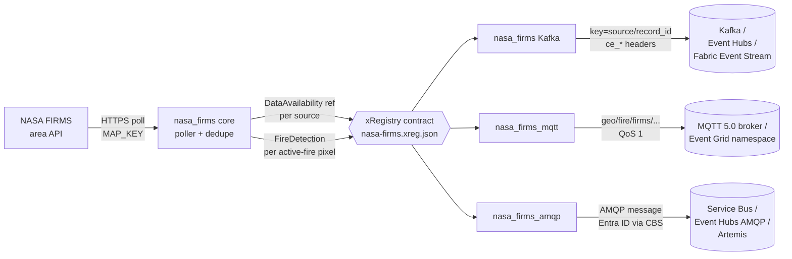

<!-- source-hero:begin -->
<table width="100%"><tr>
<td width="80" valign="middle" align="center">
<div style="font-size:48px">🌍</div>
<sub><b>Global</b></sub>
</td>
<td valign="middle">

# NASA FIRMS

<sub>global active-fire detections · Kafka · MQTT · AMQP · <a href="https://firms.modaps.eosdis.nasa.gov/">upstream</a> · <a href="https://firms.modaps.eosdis.nasa.gov/api/area/">API docs</a></sub>

  
&nbsp;
  
&nbsp;
<a href="https://github.com/clemensv/real-time-sources/actions/workflows/build_containers.yml"></a>

> Global — active fires for OSINT and situational awareness

[🚀 **Deploy to Azure**](https://clemensv.github.io/real-time-sources#nasa-firms) &nbsp;·&nbsp;
[📓 **Fabric Notebook**](https://clemensv.github.io/real-time-sources#nasa-firms/fabric-notebook) &nbsp;·&nbsp;
[🐳 **docker pull**](CONTAINER.md) &nbsp;·&nbsp;
[📑 **Event schemas**](EVENTS.md) &nbsp;·&nbsp;
[🗄️ **KQL schema**](kql/nasa-firms.kql) &nbsp;·&nbsp;
[🗺️ **Fabric Map**](fabric/README.md) &nbsp;·&nbsp;
[↗ **Upstream**](https://firms.modaps.eosdis.nasa.gov/)

</td></tr></table>
<!-- source-hero:end -->

## At a glance

<table align="right">
<tr><td valign="middle">🌍</td><td valign="middle"><b>Region</b></td><td valign="middle">🌍 Global</td></tr>
<tr><td valign="middle">🏛️</td><td valign="middle"><b>Authority</b></td><td valign="middle"><a href="https://earthdata.nasa.gov/">NASA Earth Science Data Systems</a> / LANCE</td></tr>
<tr><td valign="middle">📊</td><td valign="middle"><b>Coverage</b></td><td valign="middle">VIIRS 375 m and MODIS 1 km active-fire detections</td></tr>
<tr><td valign="middle">⏱️</td><td valign="middle"><b>Cadence</b></td><td valign="middle">~3 h NRT latency, 15-minute default poll, 1-day default range</td></tr>
<tr><td valign="middle">🔌</td><td valign="middle"><b>Transports</b></td><td valign="middle">Kafka · MQTT 5.0 · AMQP 1.0</td></tr>
<tr><td valign="middle">📍</td><td valign="middle"><b>Kafka key</b></td><td valign="middle"><code>{source}/{record_id}</code></td></tr>
<tr><td valign="middle">📦</td><td valign="middle"><b>Events</b></td><td valign="middle"><code>FireDetection</code> · <code>DataAvailability</code></td></tr>
<tr><td valign="middle">📜</td><td valign="middle"><b>License</b></td><td valign="middle">NASA LANCE/FIRMS open data, free of charge</td></tr>
<tr><td valign="middle">🔐</td><td valign="middle"><b>Auth</b></td><td valign="middle">Free Earthdata FIRMS <code>MAP_KEY</code> required</td></tr>
</table>

The bridge turns [NASA FIRMS](https://firms.modaps.eosdis.nasa.gov/) (Fire Information for Resource Management System) into a real-time CloudEvents stream for global active-fire monitoring. It polls the FIRMS area API, normalizes VIIRS and MODIS thermal-anomaly detections, emits source coverage windows first, and publishes consistent keyed events over Kafka, MQTT 5.0, or AMQP 1.0.

**Who uses it.** OSINT analysts use the global fire map to detect conflict indicators such as shelling, arson, burning infrastructure, and fast-changing fire lines. Emergency managers and wildfire-response teams watch new hotspots as near-real-time satellite signals. Environmental and air-quality teams, insurers, risk analysts, and journalists use the same stream for persistent dashboards, archive pipelines, and incident timelines.

## 60-second quick start

```bash
docker run --rm \
  -v "$PWD/state:/state" \
  -e FIRMS_MAP_KEY="<free-earthdata-map-key>" \
  -e FIRMS_LAST_POLLED_FILE=/state/nasa-firms.json \
  -e CONNECTION_STRING="Endpoint=sb://<ns>.servicebus.windows.net/;SharedAccessKeyName=...;SharedAccessKey=...;EntityPath=nasa-firms" \
  ghcr.io/clemensv/real-time-sources-nasa-firms-kafka:latest
```

Get a free FIRMS map key from <https://firms.modaps.eosdis.nasa.gov/api/map_key/>. The default source set is `VIIRS_SNPP_NRT,VIIRS_NOAA20_NRT,VIIRS_NOAA21_NRT,MODIS_NRT`; the bridge polls a 1-day window every 15 minutes and persists dedupe state in the mounted `/state` directory.

MQTT and AMQP variants take the same form — see [CONTAINER.md](CONTAINER.md) for the per-transport env-var matrix.

## Architecture



All three variants share the upstream acquisition core, the xRegistry contract (`xreg/nasa-firms.xreg.json`), and the CloudEvents schemas — switching transport never changes the data model.

## Sample event

<details>
<summary><b><code>NASA.FIRMS.FireDetection</code></b> — active-fire pixel (click to expand)</summary>

```json
{
  "specversion": "1.0",
  "type": "NASA.FIRMS.FireDetection",
  "source": "https://firms.modaps.eosdis.nasa.gov/",
  "id": "018f5f9a-0f2c-7000-9000-5b2d7f6c9a11",
  "time": "2026-05-27T07:45:00Z",
  "subject": "VIIRS_SNPP_NRT/6f5e8c6b0a4d2f10",
  "datacontenttype": "application/json",
  "data": {
    "source": "VIIRS_SNPP_NRT",
    "record_id": "6f5e8c6b0a4d2f10",
    "latitude": 48.137,
    "longitude": 11.575,
    "acq_date": "2026-05-27",
    "acq_time": "0745",
    "satellite": "Suomi-NPP"
  }
}
```

The Kafka record carries the same JSON in the value, the CloudEvents attributes as `ce_*` headers (binary content mode), and the Kafka key set to `VIIRS_SNPP_NRT/6f5e8c6b0a4d2f10` (the `{source}/{record_id}` template). On MQTT, fire detections are published under `geo/fire/firms/{source}/{confidence_level}/{tile}/detection`; data-availability reference events use `geo/fire/firms/{source}/availability`. On AMQP the same JSON is the application body with the CloudEvents attributes as `cloudEvents:*` application properties.

See [EVENTS.md](EVENTS.md) for the full schemas of both event types (`FireDetection` and `DataAvailability`) and the JsonStructure constraints.

</details>

## Transport variants

| Variant | Container image | Targets | Wire shape |
|---|---|---|---|
| **🟥 Kafka** | `ghcr.io/clemensv/real-time-sources-nasa-firms-kafka` | Apache Kafka 2.x · Azure Event Hubs · Fabric Event Streams · Confluent · Redpanda · Aiven · MSK | Single topic `nasa-firms`, binary CloudEvents (`ce_*` headers), key = `{source}/{record_id}` |
| **🟪 MQTT** | `ghcr.io/clemensv/real-time-sources-nasa-firms-mqtt` | Mosquitto · EMQX · HiveMQ · Azure Event Grid namespace · Fabric Real-Time Hub MQTT broker | UNS trees `geo/fire/firms/{source}/{confidence_level}/{tile}/detection` and `geo/fire/firms/{source}/availability`, CloudEvents as MQTT 5 user properties |
| **🟦 AMQP** | `ghcr.io/clemensv/real-time-sources-nasa-firms-amqp` | Azure Service Bus · Azure Event Hubs (AMQP surface) · ActiveMQ Artemis · Qpid · RabbitMQ AMQP 1.0 plugin | Single AMQP node, binary CloudEvents, SASL PLAIN or Entra ID via AMQP CBS (no SAS-key rotation) |

<!-- source-deploy:begin -->
## Deploy

The portal buttons wrap the underlying scripts and ARM templates documented below; pick the path that matches your destination and operational preference. Every route lands in the same Eventhouse / KQL schema if you want one — they only differ in where the feeder container or notebook runs.

### Deploying into Microsoft Fabric

NASA FIRMS targets Microsoft Fabric end-to-end: events land in a Fabric **Event Stream** (custom endpoint), an attached **Eventhouse / KQL database** materializes the contract from [`kql/`](kql/), and the bundled [Fabric Map](fabric/README.md) visualizes global active-fire state on a dark basemap for OSINT monitoring.

Two hosting models are supported. Use the deploy buttons on the [project portal](https://clemensv.github.io/real-time-sources#nasa-firms) to launch either — both walk you through the same Fabric workspace selection and follow-up steps.

#### Fabric Notebook feeder &nbsp;<sub><i>(recommended for low-volume polling)</i></sub>

A scheduled Fabric Notebook in [`notebook/`](notebook/) runs the poller inside the Fabric workspace itself, against a per-source Fabric **Environment** that bundles the `nasa_firms` package and the generated producer sub-packages. The Event Stream custom-endpoint connection string is looked up at runtime via the public Fabric Topology API using the workspace identity — no secrets in the notebook, no separate container host to manage. Dedupe state lives in OneLake under `/lakehouse/default/Files/feeder-state/nasa-firms/`.

```powershell
tools/deploy-fabric/deploy-feeder-notebook.ps1 `
  -Source nasa-firms `
  -Workspace <fabric-workspace-id-or-name> `
  -ResourceGroup <azure-rg-for-bootstrap> `
  -Location <azure-region>
```

Best fit for poll-based sources whose update cadence aligns with scheduled execution; the notebook writes a per-run diagnostic log to OneLake on every run.

[](https://clemensv.github.io/real-time-sources#nasa-firms/fabric-notebook)

#### Fabric ACI feeder &nbsp;<sub><i>(recommended for high-volume / always-on, and for MQTT or AMQP)</i></sub>

A long-running Azure Container Instance hosts the container image and writes into a Fabric Event Stream custom endpoint. Use this for continuous polling, real-time MQTT/UNS publishing, or the AMQP transport — anything that does not fit a scheduled-notebook model.

```powershell
tools/deploy-fabric/deploy-fabric-aci.ps1 `
  -Source nasa-firms `
  -Workspace <fabric-workspace-id-or-name> `
  -ResourceGroup <azure-rg> `
  -Location <azure-region>
```

The script creates the Eventhouse, the KQL database with the [`kql/`](kql/) schema and update policies, the Event Stream with a custom endpoint, the ACI with the connection string wired in, and a storage account / file share mounted at `/state` for dedupe persistence.

[](https://clemensv.github.io/real-time-sources#nasa-firms/fabric-aci)

#### Fabric Map visualization &nbsp;<sub><i>(optional, post-deploy)</i></sub>

After either hosting model has events flowing, run [`fabric/post-deploy.ps1`](fabric/README.md) (or `tools/deploy-fabric/deploy-fabric.ps1 -Source nasa-firms -Workspace <ws>`) to provision the bundled **NASA FIRMS Global Fire Map**. It uses a dark basemap, a world-view hotspot bubble layer, an individual detection bubble layer, and an FRP heat ramp for OSINT-friendly fire monitoring.


### Deploying into Azure Container Instances

Azure Container Instance templates host the container directly in Azure (without a Fabric workspace) and target an Azure Event Hubs namespace, an MQTT broker, or an AMQP 1.0 peer. The templates create a storage account and file share for persistent dedupe state.

#### Kafka — bring your own Event Hub / Kafka

Deploy the Kafka container with your own Azure Event Hubs or Fabric Event Stream connection string. You pass the connection string and `FIRMS_MAP_KEY` at deploy time; the template provisions only the container and a storage account for persistent dedupe state.

[](https://portal.azure.com/#create/Microsoft.Template/uri/https%3A%2F%2Fraw.githubusercontent.com%2Fclemensv%2Freal-time-sources%2Fmain%2Ffeeders%2Fnasa-firms%2Fazure-template.json)

#### Kafka — provision a new Event Hub

Deploy the Kafka container together with a new Event Hubs namespace and event hub. The connection string is wired automatically; provide `FIRMS_MAP_KEY` at deployment time.

[](https://portal.azure.com/#create/Microsoft.Template/uri/https%3A%2F%2Fraw.githubusercontent.com%2Fclemensv%2Freal-time-sources%2Fmain%2Ffeeders%2Fnasa-firms%2Fazure-template-with-eventhub.json)

#### MQTT — bring your own broker

Deploy the MQTT container against an existing MQTT 5 broker (Mosquitto, EMQX, HiveMQ, Azure Event Grid namespace MQTT, etc.). You provide the `mqtts://` URL, optional credentials, and `FIRMS_MAP_KEY`.

[](https://portal.azure.com/#create/Microsoft.Template/uri/https%3A%2F%2Fraw.githubusercontent.com%2Fclemensv%2Freal-time-sources%2Fmain%2Ffeeders%2Fnasa-firms%2Fazure-template-mqtt.json)

#### MQTT — provision a new Event Grid namespace MQTT broker

Deploy the MQTT container together with a new [Azure Event Grid namespace](https://learn.microsoft.com/azure/event-grid/mqtt-overview) with the MQTT broker enabled, a topic space for this source, a user-assigned managed identity, and the **EventGrid TopicSpaces Publisher** role assignment. The feeder authenticates with MQTT v5 enhanced authentication (`OAUTH2-JWT`) — no shared keys to rotate.

[](https://portal.azure.com/#create/Microsoft.Template/uri/https%3A%2F%2Fraw.githubusercontent.com%2Fclemensv%2Freal-time-sources%2Fmain%2Ffeeders%2Fnasa-firms%2Fazure-template-with-eventgrid-mqtt.json)

#### AMQP — provision a new Azure Service Bus namespace

Deploy the AMQP container together with a new [Azure Service Bus Standard namespace](https://learn.microsoft.com/azure/service-bus-messaging/service-bus-messaging-overview) with a queue, a user-assigned managed identity, and the **Azure Service Bus Data Sender** role assignment. The feeder authenticates via AMQP CBS put-token with Microsoft Entra ID — no SAS key rotation required.

[](https://portal.azure.com/#create/Microsoft.Template/uri/https%3A%2F%2Fraw.githubusercontent.com%2Fclemensv%2Freal-time-sources%2Fmain%2Ffeeders%2Fnasa-firms%2Fazure-template-with-servicebus.json)

#### AMQP — bring your own AMQP 1.0 peer

Deploy the AMQP container against an existing AMQP 1.0 peer (RabbitMQ AMQP 1.0 plugin, ActiveMQ Artemis, Qpid Dispatch, Azure Service Bus, Azure Event Hubs). You pass the broker URL, credentials, and `FIRMS_MAP_KEY`; the template provisions only the container and persistent state share.

[](https://portal.azure.com/#create/Microsoft.Template/uri/https%3A%2F%2Fraw.githubusercontent.com%2Fclemensv%2Freal-time-sources%2Fmain%2Ffeeders%2Fnasa-firms%2Fazure-template-amqp.json)


### Self-hosted

Pull and run any of the 3 container images directly — laptop, Kubernetes, Azure Container Apps, Cloud Run, ECS, bare metal. The full per-transport / per-auth-mode environment-variable matrix and sample `docker run` commands for every target broker live in [CONTAINER.md](CONTAINER.md).
<!-- source-deploy:end -->
## Configuration

<details>
<summary>Full environment-variable reference (click to expand)</summary>

| Variable | Variant | Purpose | Default |
|---|---|---|---|
| `FIRMS_MAP_KEY` | all | Free NASA Earthdata FIRMS map key from <https://firms.modaps.eosdis.nasa.gov/api/map_key/> | required |
| `CONNECTION_STRING` | Kafka | Kafka 2.x SASL/PLAIN over TLS, or Azure Event Hubs / Fabric Event Stream connection string | required for connection-string mode |
| `KAFKA_ENABLE_TLS` | Kafka | Set `false` for plaintext Kafka endpoints such as local Docker E2E | `true` |
| `MQTT_BROKER_URL` | MQTT | `mqtts://host:8883` or `mqtt://host:1883` | required |
| `MQTT_USERNAME` / `MQTT_PASSWORD` | MQTT | Username/password for generic MQTT brokers | optional |
| `MQTT_AUTH_MODE` / `MQTT_ENTRA_*` | MQTT | Entra ID JWT enhanced auth for Event Grid namespace MQTT | optional |
| `AMQP_BROKER_URL` | AMQP | `amqp[s]://[user[:pass]@]host[:port]/<entity>` | required (or component env) |
| `AMQP_AUTH_MODE` / `AMQP_ENTRA_*` / `AMQP_SAS_*` | AMQP | Generic SASL PLAIN, Entra ID CBS, or SAS-token CBS settings | optional |
| `FIRMS_SOURCES` | all | Comma-separated FIRMS source ids | `VIIRS_SNPP_NRT,VIIRS_NOAA20_NRT,VIIRS_NOAA21_NRT,MODIS_NRT` |
| `FIRMS_DAY_RANGE` | all | FIRMS day range to request, 1–10 | `1` |
| `POLLING_INTERVAL` | all | Upstream poll cadence in seconds | `900` |
| `FIRMS_LAST_POLLED_FILE` | all | Path to dedupe/checkpoint state file (mount a volume!) | `/state/nasa-firms.json` |
| `ONCE_MODE` | all | Run a single poll cycle and exit (also available as `--once`) | `false` |
| `LOG_LEVEL` | all | `DEBUG` / `INFO` / `WARNING` / `ERROR` | `INFO` |

The full per-deployment-shape env-var matrix (Entra ID via CBS or OAUTH2-JWT, SAS-token CBS, broker URL forms, etc.) lives in [CONTAINER.md](CONTAINER.md). The Kafka image's default `CMD` invokes `python -m nasa_firms feed`; the MQTT and AMQP images invoke `python -m nasa_firms_mqtt` and `python -m nasa_firms_amqp`.

</details>

## Data model

Two event types, both in message group `NASA.FIRMS` and topic `nasa-firms`:

- **`NASA.FIRMS.DataAvailability`** — reference event, emitted first each cycle for each FIRMS source. It carries the per-source coverage window (`min_date` / `max_date`) and uses `{source}/coverage` as both CloudEvents subject and Kafka key.
- **`NASA.FIRMS.FireDetection`** — telemetry event, emitted once per active-fire pixel. It carries VIIRS 375 m or MODIS 1 km thermal-anomaly / active-fire detections. The `record_id` is the first 16 hex characters of `SHA-1(source|lat|lon|acq_date|acq_time|satellite)`, and the subject/key is `{source}/{record_id}`.

Reference data and telemetry share the `{source}/{record_id}` key model and the same topic so stream processors can join detection events with the exact source coverage window observed in the same polling cycle — see [Streamifying reference data for temporal consistency with telemetry events](https://vasters.com/clemens/2024/10/30/streamifying-reference-data-for-temporal-consistency-with-telemetry-events) for the design rationale.

The complete JsonStructure schemas (with units, validation constraints, and Avro round-trip) are in [EVENTS.md](EVENTS.md).

## Repository layout

```text
nasa-firms/
├── xreg/nasa-firms.xreg.json       # shared xRegistry contract
├── nasa_firms/                     # transport-agnostic acquisition core + Kafka app
├── nasa_firms_mqtt/                # MQTT/UNS feeder application
├── nasa_firms_amqp/                # AMQP 1.0 feeder application
├── nasa_firms_producer/            # xRegistry-generated Kafka producer
├── nasa_firms_mqtt_producer/       # xRegistry-generated MQTT producer
├── nasa_firms_amqp_producer/       # xRegistry-generated AMQP producer
├── kql/nasa-firms.kql              # Eventhouse table + update policies
├── notebook/nasa-firms-feed.ipynb  # Fabric Notebook feeder
├── fabric/                         # Fabric Map and post-deploy hook
├── Dockerfile                      # builds the Kafka feeder image
├── Dockerfile.mqtt                 # builds the MQTT feeder image
├── Dockerfile.amqp                 # builds the AMQP feeder image
└── tests/                          # unit + integration tests
```

## Prerequisites (for self-hosted runs)

- Docker 20.10+ (or any OCI-compatible runtime).
- A free NASA Earthdata FIRMS `MAP_KEY` from <https://firms.modaps.eosdis.nasa.gov/api/map_key/>.
- Outbound HTTPS to `firms.modaps.eosdis.nasa.gov`.
- Network access to your target Kafka broker, MQTT broker, or AMQP 1.0 peer.
- A writable host directory mounted at `/state` so dedupe state survives restarts. **Without it, dedupe restarts cold on every container start.**

---

<sub>
📚 <a href="../README.md">← Back to catalog</a> &nbsp;·&nbsp;
🌐 <a href="https://clemensv.github.io/real-time-sources/#nasa-firms">Portal entry</a> &nbsp;·&nbsp;
📑 <a href="EVENTS.md">EVENTS.md</a> &nbsp;·&nbsp;
🐳 <a href="CONTAINER.md">CONTAINER.md</a> &nbsp;·&nbsp;
🗄️ <a href="kql/nasa-firms.kql">KQL schema</a> &nbsp;·&nbsp;
🗺️ <a href="fabric/README.md">Fabric Map</a> &nbsp;·&nbsp;
↗ <a href="https://firms.modaps.eosdis.nasa.gov/">firms.modaps.eosdis.nasa.gov</a> &nbsp;·&nbsp;
📖 <a href="https://firms.modaps.eosdis.nasa.gov/api/area/">API docs</a>
</sub>
