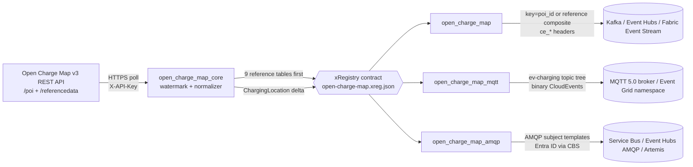

<!-- source-hero:begin -->
<table width="100%"><tr>
<td width="80" valign="middle" align="center">
<br>
<sub><b>Global</b></sub>
</td>
<td valign="middle">

# Open Charge Map

<sub>EV charging locations and reference data (requires free API key) · Kafka · MQTT · AMQP · <a href="https://openchargemap.org/">upstream</a> · <a href="https://openchargemap.org/site/develop/api">API docs</a></sub>

  
&nbsp;
  
&nbsp;
<a href="https://github.com/clemensv/real-time-sources/actions/workflows/build_containers.yml"></a>

> Global — EV charging locations and reference data (requires free API key)

[🚀 **Deploy to Azure**](https://clemensv.github.io/real-time-sources#open-charge-map) &nbsp;·&nbsp;
[📓 **Fabric Notebook**](https://clemensv.github.io/real-time-sources#open-charge-map/fabric-notebook) &nbsp;·&nbsp;
[🐳 **docker pull**](CONTAINER.md) &nbsp;·&nbsp;
[📑 **Event schemas**](EVENTS.md) &nbsp;·&nbsp;
[🗄️ **KQL schema**](kql/open-charge-map.kql) &nbsp;·&nbsp;
[↗ **Upstream**](https://openchargemap.org/)

</td></tr></table>
<!-- source-hero:end -->

# Open Charge Map

[README](README.md) - [Container contract](CONTAINER.md) - [Event schemas](EVENTS.md) - [Upstream](https://openchargemap.org/) - [API docs](https://openchargemap.org/site/develop/api)

## At a glance

<table align="right">
<tr><td valign="middle">Region</td><td valign="middle">Global</td></tr>
<tr><td valign="middle">Authority</td><td valign="middle"><a href="https://openchargemap.org/">Open Charge Map</a> community and operator-maintained registry</td></tr>
<tr><td valign="middle">Coverage</td><td valign="middle">300,000+ EV charging-location POIs worldwide</td></tr>
<tr><td valign="middle">Cadence</td><td valign="middle">600-second delta poll by default; reference tables refresh daily</td></tr>
<tr><td valign="middle">Transports</td><td valign="middle">Kafka - MQTT 5.0 - AMQP 1.0</td></tr>
<tr><td valign="middle">Kafka key</td><td valign="middle"><code>{poi_id}</code> and <code>{reference_type}/{reference_id}</code></td></tr>
<tr><td valign="middle">Events</td><td valign="middle"><code>ChargingLocation</code> + 9 reference lookup types</td></tr>
<tr><td valign="middle">Data license</td><td valign="middle">Open Charge Map open data / CC-BY-SA 4.0 attribution and share-alike</td></tr>
<tr><td valign="middle">Auth</td><td valign="middle">Free API key via <code>OPENCHARGEMAP_API_KEY</code></td></tr>
</table>

The bridge turns the [Open Charge Map](https://openchargemap.org/) v3 REST API into a near-real-time CloudEvents stream for the `ev-charging` domain. It polls charging-location points of interest (POIs) with the upstream `DateLastStatusUpdate` watermark, emits reference lookup tables first, and then publishes changed locations over Kafka, MQTT, or AMQP.

**Who uses it.** EV-infrastructure operators and analysts (global site and connector inventory); fleet-charging planners (country-scoped station discovery); charging-app backends (reference-first lookup tables without side calls); energy and mobility digital twins (typed Eventhouse / ADX ingestion); and public-sector open-data teams that need a streamable registry rather than one REST poller per application.

> [!IMPORTANT]
> Open Charge Map requires a free API key. Set `OPENCHARGEMAP_API_KEY`; the feeder sends it as the `X-API-Key` HTTP header. Register at <https://openchargemap.org/site/loginprovider/beginlogin> from the developer / API section.

## 60-second quick start

```bash
docker run --rm \
  -v "$PWD/state:/state" \
  -e OPENCHARGEMAP_API_KEY="<ocm-api-key>" \
  -e STATE_FILE=/state/open-charge-map.json \
  -e CONNECTION_STRING="Endpoint=sb://<ns>.servicebus.windows.net/;SharedAccessKeyName=...;SharedAccessKey=...;EntityPath=open-charge-map" \
  ghcr.io/clemensv/real-time-sources-open-charge-map-kafka:latest
```

The first cycle emits the nine Open Charge Map reference lookup tables and then POIs changed since the initial `OCM_MODIFIED_SINCE_DAYS` look-back watermark. Later cycles delta-poll `/v3/poi/` with `modifiedsince` and emit only changed charging locations. Mount `./state` to persist the watermark across restarts. MQTT and AMQP variants take the same form - see [CONTAINER.md](CONTAINER.md).

## Architecture



All three variants share the upstream poller (`open_charge_map_core`), the xRegistry contract (`xreg/open-charge-map.xreg.json`), and the CloudEvents schemas. Switching transport never changes the data model.

## Sample event

<details>
<summary><b><code>IO.OpenChargeMap.ChargingLocation</code></b> - changed EV charging location (click to expand)</summary>

```json
{
  "specversion": "1.0",
  "type": "IO.OpenChargeMap.ChargingLocation",
  "source": "https://api.openchargemap.io/v3/poi/#498580",
  "id": "01985f6c-2f55-7c4f-9d2a-3a8e64c4e2a1",
  "time": "2026-07-15T08:00:00Z",
  "subject": "498580",
  "datacontenttype": "application/json",
  "data": {
    "poi_id": 498580,
    "uuid": "82B28E8E-0E5F-4158-9DF0-AF9991E98162",
    "operator_id": 3296,
    "operator_title": "InstaVolt Ltd",
    "status_title": "Operational",
    "address_title": "Woodfield Way Car Park",
    "town": "Doncaster",
    "country_iso_code": "GB",
    "latitude": 53.498591581284586,
    "longitude": -1.1232887704744599,
    "date_last_status_update": "2026-07-15T08:00:00Z",
    "connections": [{ "connection_type_title": "Type 2 (Socket Only)", "power_kw": 22.0, "current_type_title": "AC (Three-Phase)", "quantity": 2 }]
  }
}
```

Kafka uses key `498580`; MQTT publishes to `ev-charging/open-charge-map/location/498580`; AMQP uses message subject `498580`. See [EVENTS.md](EVENTS.md) for all 10 event schemas.

</details>

## Transport variants

| Variant | Container image | Targets | Wire shape |
|---|---|---|---|
| **Kafka** | `ghcr.io/clemensv/real-time-sources-open-charge-map-kafka` | Apache Kafka 2.x - Azure Event Hubs - Fabric Event Streams - Confluent - Redpanda - Aiven - MSK | Single topic `open-charge-map`, CloudEvents, key = `{poi_id}` or `{reference_type}/{reference_id}` |
| **MQTT** | `ghcr.io/clemensv/real-time-sources-open-charge-map-mqtt` | Mosquitto - EMQX - HiveMQ - Azure Event Grid namespace - Fabric Real-Time Hub MQTT broker | UNS tree `ev-charging/open-charge-map/location/{poi_id}` and `ev-charging/open-charge-map/reference/{reference_type}/{reference_id}`, binary CloudEvents as MQTT 5 user properties |
| **AMQP** | `ghcr.io/clemensv/real-time-sources-open-charge-map-amqp` | Azure Service Bus - Azure Event Hubs (AMQP surface) - ActiveMQ Artemis - Qpid - RabbitMQ AMQP 1.0 plugin | Single AMQP node `open-charge-map`, binary CloudEvents, SASL PLAIN, SAS, or Entra ID via AMQP CBS |

<!-- source-deploy:begin -->
## Deploy

### Deploying into Microsoft Fabric

Open Charge Map targets Microsoft Fabric end-to-end: events land in a Fabric **Event Stream** custom endpoint and an attached **Eventhouse / KQL database** can materialize the `ChargingLocation` stream and nine reference lookup tables.

#### Fabric Notebook feeder &nbsp;<sub><i>(recommended for low-volume polling)</i></sub>

Open Charge Map is a poll-based source, so the deployment path uses [`notebook/open-charge-map-feed.ipynb`](notebook/open-charge-map-feed.ipynb): a scheduled Fabric Notebook that runs one poll cycle, resolves the Event Stream connection string via the public Fabric Topology API, and keeps state in OneLake under `/lakehouse/default/Files/feeder-state/open-charge-map/`.

```powershell
tools/deploy-fabric/deploy-feeder-notebook.ps1 `
  -Source open-charge-map `
  -Workspace <fabric-workspace-id-or-name> `
  -ResourceGroup <azure-rg-for-bootstrap> `
  -Location <azure-region>
```

[](https://clemensv.github.io/real-time-sources#open-charge-map/fabric-notebook)

#### Fabric ACI feeder &nbsp;<sub><i>(recommended for high-volume / always-on, and for MQTT or AMQP)</i></sub>

```powershell
tools/deploy-fabric/deploy-fabric-aci.ps1 `
  -Source open-charge-map `
  -Workspace <fabric-workspace-id-or-name> `
  -ResourceGroup <azure-rg> `
  -Location <azure-region>
```

[](https://clemensv.github.io/real-time-sources#open-charge-map/fabric-aci)

### Deploying into Azure Container Instances

Five one-click deployment shapes are expected for the Azure portal route; all require `OPENCHARGEMAP_API_KEY` and persistent `STATE_FILE` storage.

| Target | Button |
|---|---|
| Kafka - bring your own Event Hub / Kafka | [](https://clemensv.github.io/real-time-sources#open-charge-map/azure-kafka) |
| Kafka - provision a new Event Hub | [](https://clemensv.github.io/real-time-sources#open-charge-map/azure-eventhub) |
| MQTT - bring your own broker | [](https://clemensv.github.io/real-time-sources#open-charge-map/azure-mqtt) |
| MQTT - provision a new Event Grid namespace MQTT broker | [](https://clemensv.github.io/real-time-sources#open-charge-map/azure-eventgrid-mqtt) |
| AMQP 1.0 - provision a new Azure Service Bus namespace | [](https://clemensv.github.io/real-time-sources#open-charge-map/azure-servicebus) |

### Self-hosted

Pull and run any of the 3 container images directly. The full per-transport environment-variable matrix and sample `docker run` commands live in [CONTAINER.md](CONTAINER.md).
<!-- source-deploy:end -->

## Configuration

<details>
<summary>Full environment-variable reference (click to expand)</summary>

| Variable | Variant | Purpose | Default |
|---|---|---|---|
| `OPENCHARGEMAP_API_KEY` | all | Required Open Charge Map API key sent as `X-API-Key` | required |
| `OCM_COUNTRYCODE` | all | Optional ISO country code such as `IE`, `DE`, or `US`; unset means global | unset |
| `OCM_MODIFIED_SINCE_DAYS` | all | Cold-start look-back window for the first `modifiedsince` watermark | `1` |
| `OCM_MAX_RESULTS` | all | Maximum POI records requested per poll | `5000` |
| `OCM_OPENDATA` | all | Request only openly licensed POIs unless set false | `true` |
| `OCM_BASE_URL` | all | Override the Open Charge Map API root for testing | `https://api.openchargemap.io/v3/` |
| `POLLING_INTERVAL` | all | Upstream POI delta-poll cadence in seconds | `600` |
| `REFERENCE_REFRESH_INTERVAL` | all | Full reference-table re-emission cadence in seconds | `86400` |
| `STATE_FILE` | all | Path to the persisted watermark / dedupe state file | `~/.open_charge_map_state.json` |
| `ONCE_MODE` | all | `true` runs a single poll cycle and exits | `false` |
| `USER_AGENT` / `USER_AGENT_CONTACT` | all | HTTP identity sent to Open Charge Map | maintainer contact |
| `CONNECTION_STRING` | Kafka | Event Hubs / Fabric Event Stream connection string, or `BootstrapServer=...;EntityPath=...` | optional |
| `KAFKA_BOOTSTRAP_SERVERS` / `KAFKA_TOPIC` | Kafka | Explicit Kafka broker and topic when no connection string supplies them | required without `CONNECTION_STRING` |
| `MQTT_BROKER_URL` | MQTT | `mqtts://host:8883` or `mqtt://host:1883`; optional if `MQTT_HOST` is set | optional; defaults to localhost if no host is set |
| `AMQP_BROKER_URL` / `AMQP_ADDRESS` | AMQP | AMQP broker URL and target address | URL optional; address `open-charge-map` |

The full matrix lives in [CONTAINER.md](CONTAINER.md). Runtime modules are `open_charge_map`, `open_charge_map_mqtt`, and `open_charge_map_amqp`.

</details>

## Data model

Ten event types, all in the `IO.OpenChargeMap` CloudEvents type namespace:

- **`ChargingLocation`** - near-real-time POI state for one charging location, emitted when its upstream `DateLastStatusUpdate` watermark advances. Subject: `{poi_id}`.
- **Reference lookup events** - `Operator`, `ConnectionType`, `CurrentType`, `ChargerType`, `Country`, `DataProvider`, `StatusType`, `UsageType`, and `SubmissionStatusType`, emitted first on startup and refreshed every `REFERENCE_REFRESH_INTERVAL`. Subject: `{reference_type}/{reference_id}`.

Reference data and telemetry share Kafka topic `open-charge-map`; MQTT separates them under `location/` and `reference/` branches. The complete JsonStructure schemas are in [EVENTS.md](EVENTS.md).

## Repository layout

```text
open-charge-map/
├── xreg/open-charge-map.xreg.json          # shared xRegistry contract
├── open_charge_map_core/                   # transport-agnostic API client, normalizer, state
├── open_charge_map_kafka/                  # Kafka feeder application (module open_charge_map)
├── open_charge_map_mqtt/                   # MQTT/UNS feeder application
├── open_charge_map_amqp/                   # AMQP 1.0 feeder application
├── open_charge_map_producer/               # xRegistry-generated Kafka producer
├── open_charge_map_mqtt_producer/          # xRegistry-generated MQTT producer
├── open_charge_map_amqp_producer/          # xRegistry-generated AMQP producer
├── notebook/open-charge-map-feed.ipynb     # Fabric Notebook feeder (deployment path)
├── Dockerfile.kafka                        # builds the Kafka feeder image
├── Dockerfile.mqtt                         # builds the MQTT feeder image
├── Dockerfile.amqp                         # builds the AMQP feeder image
└── tests/                                  # unit + integration tests
```

## Prerequisites (for self-hosted runs)

- Docker 20.10+ (or any OCI-compatible runtime).
- A free Open Charge Map API key in `OPENCHARGEMAP_API_KEY`.
- Outbound HTTPS to `https://api.openchargemap.io/v3/`.
- Network access to your target Kafka broker, MQTT broker, or AMQP 1.0 peer.
- A writable host directory mounted at `/state` so the delta watermark survives restarts.
- Downstream applications must attribute Open Charge Map and preserve share-alike terms where applicable.

---

<sub>
<a href="../README.md">Back to catalog</a> -
<a href="https://clemensv.github.io/real-time-sources/#open-charge-map">Portal entry</a> -
<a href="EVENTS.md">EVENTS.md</a> -
<a href="CONTAINER.md">CONTAINER.md</a> -
<a href="https://openchargemap.org/">Open Charge Map</a> -
<a href="https://openchargemap.org/site/develop/api">API docs</a>
</sub>
