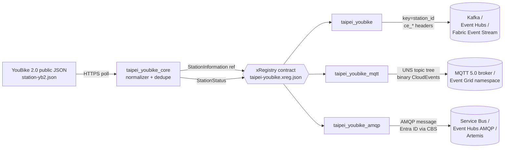

<!-- source-hero:begin -->
<table width="100%"><tr>
<td width="80" valign="middle" align="center">
<br>
<sub><b>Taiwan</b></sub>
</td>
<td valign="middle">

# YouBike 2.0 Taiwan

<sub>YouBike 2.0 island-wide bikeshare, ~9,348 stations · Kafka · MQTT · AMQP</sub>

  
&nbsp;
  
&nbsp;
<a href="https://github.com/clemensv/real-time-sources/actions/workflows/build_containers.yml"></a>

> Taiwan — YouBike 2.0 island-wide bikeshare, ~9,348 stations

[🚀 **Deploy to Azure**](https://clemensv.github.io/real-time-sources#taipei-youbike) &nbsp;·&nbsp;
[📓 **Fabric Notebook**](https://clemensv.github.io/real-time-sources#taipei-youbike/fabric-notebook) &nbsp;·&nbsp;
[🐳 **docker pull**](CONTAINER.md) &nbsp;·&nbsp;
[📑 **Event schemas**](EVENTS.md) &nbsp;·&nbsp;
[🗄️ **KQL schema**](kql/taipei-youbike.kql)

</td></tr></table>
<!-- source-hero:end -->

# Taipei YouBike 2.0

[🚀 **Deploy to Azure**](https://clemensv.github.io/real-time-sources#taipei-youbike) &nbsp;·&nbsp;
[📓 **Fabric Notebook**](https://clemensv.github.io/real-time-sources#taipei-youbike/fabric-notebook) &nbsp;·&nbsp;
[🐳 **docker pull**](CONTAINER.md) &nbsp;·&nbsp;
[📑 **Event schemas**](EVENTS.md) &nbsp;·&nbsp;
[🗺️ **Fabric Map**](fabric/README.md) &nbsp;·&nbsp;
[🗄️ **KQL schema**](kql/taipei-youbike.kql) &nbsp;·&nbsp;
[↗ **Upstream**](https://apis.youbike.com.tw/json/station-yb2.json)

## At a glance

<table align="right">
<tr><td valign="middle">🌍</td><td valign="middle"><b>Region</b></td><td valign="middle">🇹🇼 Taiwan — island-wide YouBike 2.0 network</td></tr>
<tr><td valign="middle">🏛️</td><td valign="middle"><b>Authority</b></td><td valign="middle">Taiwan municipal open-data portals / TDX; YouBike Co., Ltd. data originator</td></tr>
<tr><td valign="middle">📊</td><td valign="middle"><b>Coverage</b></td><td valign="middle">~9,348 YouBike 2.0 docking stations</td></tr>
<tr><td valign="middle">⏱️</td><td valign="middle"><b>Cadence</b></td><td valign="middle">60-second poll by default</td></tr>
<tr><td valign="middle">🔌</td><td valign="middle"><b>Transports</b></td><td valign="middle">Kafka · MQTT 5.0 · AMQP 1.0</td></tr>
<tr><td valign="middle">📍</td><td valign="middle"><b>Kafka key</b></td><td valign="middle"><code>{station_id}</code></td></tr>
<tr><td valign="middle">📦</td><td valign="middle"><b>Events</b></td><td valign="middle"><code>StationInformation</code> · <code>StationStatus</code></td></tr>
<tr><td valign="middle">📜</td><td valign="middle"><b>License</b></td><td valign="middle"><a href="https://data.gov.tw/license">Open Government Data License, Taiwan v1.0</a> for government open-data mirrors</td></tr>
<tr><td valign="middle">🔐</td><td valign="middle"><b>Auth</b></td><td valign="middle">Anonymous HTTPS JSON snapshot</td></tr>
</table>

The bridge turns the YouBike 2.0 (微笑單車) public station snapshot into a
real-time CloudEvents stream that consumers can subscribe to instead of polling
JSON themselves. It handles polling, station/status normalization, dedupe state,
CloudEvents identity plumbing, retries, and three drop-in transport variants.

**Who uses it.** Micromobility operations teams (dock capacity and balancing);
city dashboards and trip planners (near-real-time station availability across
Taiwan); transport analytics teams (live occupancy and electric-bike share);
event operations (station pressure around rail hubs, campuses, stadiums, and
night markets); digital twins and Fabric Eventhouse / ADX consumers that need a
stable stream instead of one polling integration per application.

YouBike real-time open data is mirrored by Taiwanese municipal open-data portals
(such as Taipei City and New Taipei City) and the national TDX platform under
the [Open Government Data License, Taiwan v1.0](https://data.gov.tw/license).
Attribute downstream use to the relevant municipal open-data platform and
YouBike Co., Ltd. as the data originator. The operator backend endpoint consumed
by this feeder is a separate distribution channel; this documentation does not
claim that endpoint itself is independently OGDL-licensed.

## 60-second quick start

```bash
docker run --rm \
  -v "$PWD/state:/state" \
  -e STATE_FILE=/state/taipei-youbike.json \
  -e CONNECTION_STRING="Endpoint=sb://<ns>.servicebus.windows.net/;SharedAccessKeyName=...;SharedAccessKey=...;EntityPath=taipei-youbike" \
  ghcr.io/clemensv/real-time-sources-taipei-youbike-kafka:latest
```

That's it. The first cycle emits `StationInformation` reference events for the
YouBike station catalog; subsequent cycles emit reference events when station
metadata changes or the reference-refresh interval is due, and `StationStatus`
telemetry when live bike/dock availability changes. Mount `./state` to persist
dedupe across restarts.

MQTT and AMQP variants take the same form — see
[CONTAINER.md](CONTAINER.md) for the per-transport env-var matrix.

## Architecture



All three variants share the upstream poller (`taipei_youbike_core`), the
xRegistry contract (`xreg/taipei-youbike.xreg.json`), and the CloudEvents
schemas — switching transport never changes the data model.

## Sample event

<details>
<summary><b><code>TW.YouBike.StationStatus</code></b> — live docking-station availability (click to expand)</summary>

```json
{
  "specversion": "1.0",
  "type": "TW.YouBike.StationStatus",
  "source": "https://apis.youbike.com.tw/json/station-yb2.json#500101001",
  "id": "01985f6c-2f55-7c4f-9d2a-3a8e64c4e2a1",
  "time": "2026-07-14T17:50:00Z",
  "subject": "500101001",
  "datacontenttype": "application/json",
  "data": {
    "station_id": "500101001",
    "num_bikes_available": 12,
    "num_bikes_yb1": 0,
    "num_bikes_yb2": 9,
    "num_ebikes_available": 3,
    "num_empty_docks": 15,
    "num_forbidden_docks": 0,
    "availability_level": 60,
    "service_status": 1,
    "updated_at": "2026-07-14T17:49:34Z",
    "snapshot_time": "2026-07-14T17:49:04Z"
  }
}
```

The Kafka record carries the same JSON in the value, the CloudEvents attributes
as `ce_*` headers, and the Kafka key set to `500101001` (the `{station_id}`
template). On MQTT the same JSON is published to
`mobility/taipei-youbike/500101001/status` (binary CloudEvents as MQTT 5 user
properties). On AMQP the same JSON is the application body with the CloudEvents
attributes as `cloudEvents:*` application properties.

See [EVENTS.md](EVENTS.md) for the full schemas of both event types
(`StationInformation` and `StationStatus`) and the JsonStructure constraints.

</details>

## Transport variants

| Variant | Container image | Targets | Wire shape |
|---|---|---|---|
| **🟥 Kafka** | `ghcr.io/clemensv/real-time-sources-taipei-youbike-kafka` | Apache Kafka 2.x · Azure Event Hubs · Fabric Event Streams · Confluent · Redpanda · Aiven · MSK | Single topic `taipei-youbike`, CloudEvents, key = `{station_id}` |
| **🟪 MQTT** | `ghcr.io/clemensv/real-time-sources-taipei-youbike-mqtt` | Mosquitto · EMQX · HiveMQ · Azure Event Grid namespace · Fabric Real-Time Hub MQTT broker | UNS tree `mobility/taipei-youbike/{station_id}/{info|status}`, binary CloudEvents as MQTT 5 user properties |
| **🟦 AMQP** | `ghcr.io/clemensv/real-time-sources-taipei-youbike-amqp` | Azure Service Bus · Azure Event Hubs (AMQP surface) · ActiveMQ Artemis · Qpid · RabbitMQ AMQP 1.0 plugin | Single AMQP node `taipei-youbike`, binary CloudEvents, SASL PLAIN, SAS, or Entra ID via AMQP CBS |

<!-- source-deploy:begin -->
## Deploy

The portal buttons wrap the underlying scripts documented below; pick the path
that matches your destination and operational preference. Every route lands in
the same Eventhouse / KQL schema if you want one — they only differ in where the
feeder container or notebook runs.

### Deploying into Microsoft Fabric

Taipei YouBike targets Microsoft Fabric end-to-end: events land in a Fabric
**Event Stream** (custom endpoint), an attached **Eventhouse / KQL database**
materializes the contract from [`kql/`](kql/) into typed tables
`['TW.YouBike.StationInformation']` and `['TW.YouBike.StationStatus']`, and the
bundled [**Fabric Map**](fabric/README.md) visualizes all ~9,348 stations on a
Taiwan basemap — colored by bike availability, sized by capacity, with a labels
layer and an empty-docks overlay for riders returning a bike.

Two hosting models are supported. Use the deploy buttons on the [project portal](https://clemensv.github.io/real-time-sources#taipei-youbike) to launch either — both walk you through the same Fabric workspace selection and follow-up steps.

#### Fabric Notebook feeder &nbsp;<sub><i>(recommended for low-volume polling)</i></sub>

A scheduled Fabric Notebook in [`notebook/`](notebook/) runs the poller inside
the Fabric workspace itself, against a per-source Fabric **Environment** that
bundles the `taipei_youbike` package and the generated producer sub-packages.
The Event Stream custom-endpoint connection string is looked up at runtime via
the public Fabric Topology API using the workspace identity — no secrets in the
notebook, no separate container host to manage. Dedupe state lives in OneLake
under `/lakehouse/default/Files/feeder-state/taipei-youbike/`.

```powershell
tools/deploy-fabric/deploy-feeder-notebook.ps1 `
  -Source taipei-youbike `
  -Workspace <fabric-workspace-id-or-name> `
  -ResourceGroup <azure-rg-for-bootstrap> `
  -Location <azure-region>
```

Best fit for poll-based sources whose update cadence aligns with scheduled
execution; the notebook writes a per-run diagnostic log to OneLake on every run.

[](https://clemensv.github.io/real-time-sources#taipei-youbike/fabric-notebook)

#### Fabric ACI feeder &nbsp;<sub><i>(recommended for high-volume / always-on, and for MQTT or AMQP)</i></sub>

A long-running Azure Container Instance hosts the container image and writes
into a Fabric Event Stream custom endpoint. Use this for continuous polling,
real-time MQTT/UNS publishing, or the AMQP transport — anything that does not
fit a scheduled-notebook model.

```powershell
tools/deploy-fabric/deploy-fabric-aci.ps1 `
  -Source taipei-youbike `
  -Workspace <fabric-workspace-id-or-name> `
  -ResourceGroup <azure-rg> `
  -Location <azure-region>
```

The script creates the Eventhouse, the KQL database with the [`kql/`](kql/)
schema and update policies, the Event Stream with a custom endpoint, the ACI
with the connection string wired in, and a storage account / file share mounted
at `/state` for dedupe persistence. As a final step it runs the
[`fabric/`](fabric/README.md) post-deploy hook, which creates the
**`taipei-youbike-map`** Map item and wires its station-availability, labels,
and empty-docks layers over the live KQL tables.

[](https://clemensv.github.io/real-time-sources#taipei-youbike/fabric-aci)

### Deploying into Azure Container Instances

Use the Fabric ACI deploy script above when you want an Eventhouse-backed route,
or run one of the three OCI images directly in your own Azure Container Instance
against an existing Event Hubs namespace, MQTT broker, or AMQP 1.0 peer. This
worktree currently ships the three Dockerfiles but no source-local
`azure-template*.json` one-click ARM templates.

### Self-hosted

Pull and run any of the 3 container images directly — laptop, Kubernetes, Azure
Container Apps, Cloud Run, ECS, bare metal. The full per-transport /
per-auth-mode environment-variable matrix and sample `docker run` commands for
every target broker live in [CONTAINER.md](CONTAINER.md).
<!-- source-deploy:end -->

## Configuration

<details>
<summary>Full environment-variable reference (click to expand)</summary>

| Variable | Variant | Purpose | Default |
|---|---|---|---|
| `FEED_URL` | all | Override the YouBike public station JSON snapshot endpoint (for mirrors/testing) | `https://apis.youbike.com.tw/json/station-yb2.json` |
| `CONNECTION_STRING` | Kafka | Kafka 2.x SASL/PLAIN over TLS, Azure Event Hubs, or Fabric Event Stream connection string | required unless explicit Kafka settings are used |
| `KAFKA_BOOTSTRAP_SERVERS` | Kafka | Comma-separated Kafka bootstrap servers | required without `CONNECTION_STRING` |
| `KAFKA_TOPIC` | Kafka | Kafka topic to publish into | required without `CONNECTION_STRING` |
| `MQTT_BROKER_URL` | MQTT | `mqtts://host:8883` or `mqtt://host:1883` | optional if `MQTT_HOST` is set; defaults to localhost when omitted |
| `MQTT_AUTH_MODE` | MQTT | `password` or `entra` for Event Grid namespace MQTT | `password` |
| `AMQP_BROKER_URL` | AMQP | `amqp[s]://[user[:pass]@]host[:port]/<entity>` | optional if `AMQP_HOST` is set |
| `AMQP_AUTH_MODE` | AMQP | `password`, `entra`, or `sas` | `password` |
| `AMQP_ADDRESS` | AMQP | AMQP queue/topic/address | `taipei-youbike` |
| `STATE_FILE` | all | Path to dedupe state file (mount a volume!) | `~/.taipei_youbike_state.json` |
| `POLLING_INTERVAL` | all | Upstream poll cadence | `60` |
| `REFERENCE_REFRESH_INTERVAL` | all | Station-reference re-emit cadence | `3600` |
| `ONCE_MODE` | all | Run a single poll cycle and exit (for cron/Fabric notebook) | `false` |
| `USER_AGENT` / `USER_AGENT_CONTACT` | all | HTTP identity sent to the YouBike endpoint | maintainer contact |

The full per-deployment-shape env-var matrix (Entra ID via CBS or OAUTH2-JWT,
SAS-token CBS, Service Bus emulator, Event Grid MQTT, etc.) lives in
[CONTAINER.md](CONTAINER.md). The runtime entry point for every image is
`python -m taipei_youbike{,_mqtt,_amqp} feed`; the image's default `CMD` invokes
it for you.

</details>

## Data model

Two event types, both in namespace `TW.YouBike`:

- **`StationInformation`** — reference event, emitted first each cycle on
  startup, whenever station identity/location/capacity/region fields change,
  and on periodic reference refresh. Carries `station_id`, `name_tw`, `name_en`,
  `name_cn`, `district_tw`, `district_en`, `district_cn`, `address_tw`,
  `address_en`, `address_cn`, WGS 84 `lat` / `lon`, physical `capacity`,
  `station_type`, `country_code`, `area_code`, and `img`. Subject:
  `{station_id}`.
- **`StationStatus`** — telemetry event, emitted when availability changes.
  Carries `station_id`, `num_bikes_available`, `num_bikes_yb1`,
  `num_bikes_yb2`, `num_ebikes_available`, `num_empty_docks`,
  `num_forbidden_docks`, `availability_level`, `service_status`, `updated_at`,
  and `snapshot_time`. Subject: `{station_id}`.

Both events are keyed by `{station_id}` so a consumer joining a
`StationInformation`-keyed table with a `StationStatus`-keyed stream always sees
the temporally consistent station metadata for each availability update — see
[Streamifying reference data for temporal consistency with telemetry events](https://vasters.com/clemens/2024/10/30/streamifying-reference-data-for-temporal-consistency-with-telemetry-events)
for the design rationale.

### StationInformation fields

| Field | Type | Upstream source | Notes |
|---|---|---|---|
| `station_id` | string | `station_no` | Stable YouBike station number, for example `500101001`; CloudEvents subject and transport key. |
| `name_tw` / `name_en` / `name_cn` | string/null | `name_tw` / `name_en` / `name_cn` | Traditional Chinese, English, and Simplified Chinese station names; empty localized strings become null. |
| `district_tw` / `district_en` / `district_cn` | string/null | `district_*` | Administrative district labels. |
| `address_tw` / `address_en` / `address_cn` | string/null | `address_*` | Station street address in localized forms. |
| `lat` / `lon` | double | `lat` / `lng` | WGS 84 coordinates in decimal degrees. |
| `capacity` | int/null | `parking_spaces` | Nominal physical docking capacity. |
| `station_type` | int | `type` | YouBike station generation code; current feed exposes YouBike 2.0 stations. |
| `country_code` / `area_code` | string/null | `country_code` / `area_code` | Operator administrative codes for Taiwan / service area. |
| `img` | string/null | `img` | Relative station photograph URL path on the YouBike site. |

### StationStatus fields

| Field | Type | Upstream source | Notes |
|---|---|---|---|
| `station_id` | string | `station_no` | Matches the `StationInformation` key. |
| `num_bikes_available` | int | `available_spaces` | Total rentable bikes. |
| `num_bikes_yb1` | int/null | `available_spaces_detail.yb1` | First-generation YouBike 1.0 count; YouBike 1.0 is retired and this is currently always `0` when present. |
| `num_bikes_yb2` | int/null | `available_spaces_detail.yb2` | Standard YouBike 2.0 mechanical bikes available. |
| `num_ebikes_available` | int/null | `available_spaces_detail.eyb` | Electric YouBike / YouBike 2.0E bikes available. |
| `num_empty_docks` | int | `empty_spaces` | Empty docks available for returns. |
| `num_forbidden_docks` | int/null | `forbidden_spaces` | Disabled or out-of-service docks. |
| `availability_level` | int/null | `available_spaces_level` | Six-step gauge value `0`, `20`, `40`, `60`, `80`, or `100`. |
| `service_status` | int | `status` | `1` = normal operation (正常營運), `2` = suspended (暫停營運), `0` = stopped (停止營運). |
| `updated_at` | datetime | `updated_at` | Backend record-update time, converted from Asia/Taipei local time to UTC. |
| `snapshot_time` | datetime/null | `time` | Station IoT sensor collection time, converted from Asia/Taipei local time to UTC. |

The complete JsonStructure schemas (with units, validation constraints, and
Avro round-trip) are in [EVENTS.md](EVENTS.md).

## Repository layout

```text
taipei-youbike/
├── xreg/taipei-youbike.xreg.json          # shared xRegistry contract
├── taipei_youbike_core/                   # transport-agnostic poller + normalizer
├── taipei_youbike_kafka/                  # Kafka feeder application
├── taipei_youbike_mqtt/                   # MQTT/UNS feeder application
├── taipei_youbike_amqp/                   # AMQP 1.0 feeder application
├── taipei_youbike_producer/               # xRegistry-generated Kafka producer
├── taipei_youbike_mqtt_producer/          # xRegistry-generated MQTT producer
├── taipei_youbike_amqp_producer/          # xRegistry-generated AMQP producer
├── kql/taipei-youbike.kql                 # Eventhouse table + update policies
├── notebook/taipei-youbike-feed.ipynb     # Fabric Notebook feeder
├── fabric/                                # Fabric Map post-deploy hook + layer wiring
├── Dockerfile.kafka                       # builds the Kafka feeder image
├── Dockerfile.mqtt                        # builds the MQTT feeder image
├── Dockerfile.amqp                        # builds the AMQP feeder image
└── tests/                                 # unit + integration tests
```

## Prerequisites (for self-hosted runs)

- Docker 20.10+ (or any OCI-compatible runtime).
- Outbound HTTPS to `https://apis.youbike.com.tw/json/station-yb2.json`; no API
  key is required.
- Network access to your target Kafka broker, MQTT broker, or AMQP 1.0 peer.
- A writable host directory mounted at `/state` so dedupe state survives
  restarts. **Without it, dedupe restarts cold on every container start.**
- Downstream applications should preserve attribution to the relevant Taiwanese
  municipal open-data platform / TDX mirror and YouBike Co., Ltd. as data
  originator.

---

<sub>
📚 <a href="../README.md">← Back to catalog</a> &nbsp;·&nbsp;
🌐 <a href="https://clemensv.github.io/real-time-sources/#taipei-youbike">Portal entry</a> &nbsp;·&nbsp;
📑 <a href="EVENTS.md">EVENTS.md</a> &nbsp;·&nbsp;
🐳 <a href="CONTAINER.md">CONTAINER.md</a> &nbsp;·&nbsp;
🗄️ <a href="kql/taipei-youbike.kql">KQL schema</a> &nbsp;·&nbsp;
🗺️ <a href="fabric/README.md">Fabric Map</a> &nbsp;·&nbsp;
↗ <a href="https://apis.youbike.com.tw/json/station-yb2.json">YouBike station feed</a> &nbsp;·&nbsp;
📖 <a href="https://tdx.transportdata.tw/">TDX</a>
</sub>
