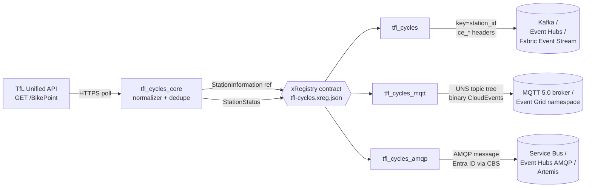

<!-- source-hero:begin -->
<table width="100%"><tr>
<td width="80" valign="middle" align="center">
<br>
<sub><b>United Kingdom</b></sub>
</td>
<td valign="middle">

# TfL Santander Cycles

<sub>London public bikeshare, ~798 docking stations · Kafka · MQTT · AMQP · <a href="https://tfl.gov.uk/modes/cycling/santander-cycles">upstream</a> · <a href="https://api.tfl.gov.uk/">API docs</a></sub>

  
&nbsp;
  
&nbsp;
<a href="https://github.com/clemensv/real-time-sources/actions/workflows/build_containers.yml"></a>

> United Kingdom — London Santander Cycles docking-station catalog and live availability

[🚀 **Deploy to Azure**](https://clemensv.github.io/real-time-sources#tfl-cycles) &nbsp;·&nbsp;
[📓 **Fabric Notebook**](https://clemensv.github.io/real-time-sources#tfl-cycles/fabric-notebook) &nbsp;·&nbsp;
[🐳 **docker pull**](CONTAINER.md) &nbsp;·&nbsp;
[📑 **Event schemas**](EVENTS.md) &nbsp;·&nbsp;
[🗄️ **KQL schema**](kql/tfl-cycles.kql) &nbsp;·&nbsp;
[↗ **Upstream**](https://api.tfl.gov.uk/BikePoint)

</td></tr></table>
<!-- source-hero:end -->

## At a glance

<table align="right">
<tr><td valign="middle">🌍</td><td valign="middle"><b>Region</b></td><td valign="middle">🇬🇧 London, United Kingdom</td></tr>
<tr><td valign="middle">🏛️</td><td valign="middle"><b>Authority</b></td><td valign="middle"><a href="https://tfl.gov.uk/">Transport for London (TfL)</a></td></tr>
<tr><td valign="middle">📊</td><td valign="middle"><b>Coverage</b></td><td valign="middle">~798 Santander Cycles docking stations</td></tr>
<tr><td valign="middle">⏱️</td><td valign="middle"><b>Cadence</b></td><td valign="middle">60-second poll by default</td></tr>
<tr><td valign="middle">🔌</td><td valign="middle"><b>Transports</b></td><td valign="middle">Kafka · MQTT 5.0 · AMQP 1.0</td></tr>
<tr><td valign="middle">📍</td><td valign="middle"><b>Kafka key</b></td><td valign="middle"><code>{station_id}</code></td></tr>
<tr><td valign="middle">📦</td><td valign="middle"><b>Events</b></td><td valign="middle"><code>StationInformation</code> · <code>StationStatus</code></td></tr>
<tr><td valign="middle">📜</td><td valign="middle"><b>License</b></td><td valign="middle"><a href="https://tfl.gov.uk/info-for/open-data-users/open-data-policy">TfL Open Data terms</a></td></tr>
<tr><td valign="middle">🔐</td><td valign="middle"><b>Auth</b></td><td valign="middle">Anonymous REST; optional <code>TFL_APP_KEY</code></td></tr>
</table>

The bridge turns the Transport for London [Unified API BikePoint](https://api.tfl.gov.uk/BikePoint)
resource into a real-time CloudEvents stream that consumers can subscribe to
instead of polling REST themselves. It handles polling, station/status
normalization, dedupe state, CloudEvents identity plumbing, retries, and three
drop-in transport variants.

**Who uses it.** Micromobility operations teams (dock capacity and balancing);
city dashboards and trip planners (near-real-time station availability);
transport analytics teams (live occupancy and e-bike share trends); event
operations (station pressure around stadiums, termini, and road closures);
digital twins and Fabric Eventhouse / ADX consumers that need a stable stream
instead of one polling integration per application.

TfL requires attribution for downstream use of its open data. Include
**"Powered by TfL Open Data"** where you surface this feed. TfL notes that its
open data contains Ordnance Survey data © Crown copyright and database rights.

## 60-second quick start

```bash
docker run --rm \
  -v "$PWD/state:/state" \
  -e STATE_FILE=/state/tfl-cycles.json \
  -e CONNECTION_STRING="Endpoint=sb://<ns>.servicebus.windows.net/;SharedAccessKeyName=...;SharedAccessKey=...;EntityPath=tfl-cycles" \
  ghcr.io/clemensv/real-time-sources-tfl-cycles-kafka:latest
```

That's it. The first cycle emits `StationInformation` reference events for the
TfL BikePoint station catalog; subsequent cycles emit reference events when
station metadata changes or the reference-refresh interval is due, and
`StationStatus` telemetry when live bike/dock availability changes. Mount
`./state` to persist dedupe across restarts.

MQTT and AMQP variants take the same form — see
[CONTAINER.md](CONTAINER.md) for the per-transport env-var matrix.

## Architecture



All three variants share the upstream poller (`tfl_cycles_core`), the
xRegistry contract (`xreg/tfl-cycles.xreg.json`), and the CloudEvents schemas
— switching transport never changes the data model.

## Sample event

<details>
<summary><b><code>UK.Gov.TfL.Cycles.StationStatus</code></b> — live docking-station availability (click to expand)</summary>

```json
{
  "specversion": "1.0",
  "type": "UK.Gov.TfL.Cycles.StationStatus",
  "source": "https://api.tfl.gov.uk/BikePoint/BikePoints_1",
  "id": "01985f6c-2f55-7c4f-9d2a-3a8e64c4e2a1",
  "time": "2026-07-14T09:50:00Z",
  "subject": "BikePoints_1",
  "datacontenttype": "application/json",
  "data": {
    "station_id": "BikePoints_1",
    "num_bikes_available": 12,
    "num_standard_bikes_available": 10,
    "num_ebikes_available": 2,
    "num_empty_docks": 7,
    "num_docks": 19,
    "is_installed": true,
    "is_locked": false,
    "modified": "2026-07-14T09:49:30Z"
  }
}
```

The Kafka record carries the same JSON in the value, the CloudEvents
attributes as `ce_*` headers, and the Kafka key set to `BikePoints_1`
(the `{station_id}` template). On MQTT the same JSON is published to
`mobility/tfl-cycles/BikePoints_1/status` (binary CloudEvents as MQTT 5
user properties). On AMQP the same JSON is the application body with the
CloudEvents attributes as `cloudEvents:*` application properties.

See [EVENTS.md](EVENTS.md) for the full schemas of both event types
(`StationInformation` and `StationStatus`) and the JsonStructure constraints.

</details>

## Transport variants

| Variant | Container image | Targets | Wire shape |
|---|---|---|---|
| **🟥 Kafka** | `ghcr.io/clemensv/real-time-sources-tfl-cycles-kafka` | Apache Kafka 2.x · Azure Event Hubs · Fabric Event Streams · Confluent · Redpanda · Aiven · MSK | Single topic `tfl-cycles`, CloudEvents, key = `{station_id}` |
| **🟪 MQTT** | `ghcr.io/clemensv/real-time-sources-tfl-cycles-mqtt` | Mosquitto · EMQX · HiveMQ · Azure Event Grid namespace · Fabric Real-Time Hub MQTT broker | UNS tree `mobility/tfl-cycles/{station_id}/{info|status}`, binary CloudEvents as MQTT 5 user properties |
| **🟦 AMQP** | `ghcr.io/clemensv/real-time-sources-tfl-cycles-amqp` | Azure Service Bus · Azure Event Hubs (AMQP surface) · ActiveMQ Artemis · Qpid · RabbitMQ AMQP 1.0 plugin | Single AMQP node, binary CloudEvents, SASL PLAIN, SAS, or Entra ID via AMQP CBS |

<!-- source-deploy:begin -->
## Deploy

The portal buttons wrap the underlying scripts and ARM templates documented
below; pick the path that matches your destination and operational preference.
Every route lands in the same Eventhouse / KQL schema if you want one — they
only differ in where the feeder container or notebook runs.

### Deploying into Microsoft Fabric

TfL Santander Cycles targets Microsoft Fabric end-to-end: events land in a
Fabric **Event Stream** (custom endpoint), an attached **Eventhouse / KQL
database** materializes the contract from [`kql/`](kql/), and consumers query
the station catalog and live availability tables directly.

Two hosting models are supported. Use the deploy buttons on the [project portal](https://clemensv.github.io/real-time-sources#tfl-cycles) to launch either — both walk you through the same Fabric workspace selection and follow-up steps.

#### Fabric Notebook feeder &nbsp;<sub><i>(recommended for low-volume polling)</i></sub>

A scheduled Fabric Notebook in [`notebook/`](notebook/) runs the poller inside
the Fabric workspace itself, against a per-source Fabric **Environment** that
bundles the `tfl_cycles` package and the generated producer sub-packages. The
Event Stream custom-endpoint connection string is looked up at runtime via the
public Fabric Topology API using the workspace identity — no secrets in the
notebook, no separate container host to manage. Dedupe state lives in OneLake
under `/lakehouse/default/Files/feeder-state/tfl-cycles/`.

```powershell
tools/deploy-fabric/deploy-feeder-notebook.ps1 `
  -Source tfl-cycles `
  -Workspace <fabric-workspace-id-or-name> `
  -ResourceGroup <azure-rg-for-bootstrap> `
  -Location <azure-region>
```

Best fit for poll-based sources whose update cadence aligns with scheduled
execution; the notebook writes a per-run diagnostic log to OneLake on every run.

[](https://clemensv.github.io/real-time-sources#tfl-cycles/fabric-notebook)

#### Fabric ACI feeder &nbsp;<sub><i>(recommended for high-volume / always-on, and for MQTT or AMQP)</i></sub>

A long-running Azure Container Instance hosts the container image and writes
into a Fabric Event Stream custom endpoint. Use this for continuous polling,
real-time MQTT/UNS publishing, or the AMQP transport — anything that does not
fit a scheduled-notebook model.

```powershell
tools/deploy-fabric/deploy-fabric-aci.ps1 `
  -Source tfl-cycles `
  -Workspace <fabric-workspace-id-or-name> `
  -ResourceGroup <azure-rg> `
  -Location <azure-region>
```

The script creates the Eventhouse, the KQL database with the [`kql/`](kql/)
schema and update policies, the Event Stream with a custom endpoint, the ACI
with the connection string wired in, and a storage account / file share mounted
at `/state` for dedupe persistence.

[](https://clemensv.github.io/real-time-sources#tfl-cycles/fabric-aci)

### Deploying into Azure Container Instances

5 one-click deployment templates — one per realistic Azure target. These
templates host the container directly in Azure (without a Fabric workspace) and
target an Azure Event Hubs namespace, an MQTT broker, or an AMQP 1.0 peer. All
templates create a storage account and file share for persistent dedupe state.

#### Kafka — bring your own Event Hub / Kafka

Deploy the Kafka container with your own Azure Event Hubs or Fabric Event
Stream connection string. You pass the connection string at deploy time; the
template provisions only the container and a storage account for persistent
dedupe state.

[](https://portal.azure.com/#create/Microsoft.Template/uri/https%3A%2F%2Fraw.githubusercontent.com%2Fclemensv%2Freal-time-sources%2Fmain%2Ffeeders%2Ftfl-cycles%2Fazure-template.json)

#### Kafka — provision a new Event Hub

Deploy the Kafka container together with a new Event Hubs namespace (Standard
SKU, 1 throughput unit) and event hub. The connection string is wired
automatically.

[](https://portal.azure.com/#create/Microsoft.Template/uri/https%3A%2F%2Fraw.githubusercontent.com%2Fclemensv%2Freal-time-sources%2Fmain%2Ffeeders%2Ftfl-cycles%2Fazure-template-with-eventhub.json)

#### MQTT — bring your own broker

Deploy the MQTT container against an existing MQTT 5 broker (Mosquitto, EMQX,
HiveMQ, Azure Event Grid namespace MQTT, etc.). You provide the `mqtts://` URL
and optional credentials.

[](https://portal.azure.com/#create/Microsoft.Template/uri/https%3A%2F%2Fraw.githubusercontent.com%2Fclemensv%2Freal-time-sources%2Fmain%2Ffeeders%2Ftfl-cycles%2Fazure-template-mqtt.json)

#### MQTT — provision a new Event Grid namespace MQTT broker

Deploy the MQTT container together with a new [Azure Event Grid namespace](https://learn.microsoft.com/azure/event-grid/mqtt-overview) with the MQTT broker enabled, a topic space for this source, a user-assigned managed identity, and the **EventGrid TopicSpaces Publisher** role assignment. The feeder authenticates with MQTT v5 enhanced authentication (`OAUTH2-JWT`) — no shared keys to rotate.

[](https://portal.azure.com/#create/Microsoft.Template/uri/https%3A%2F%2Fraw.githubusercontent.com%2Fclemensv%2Freal-time-sources%2Fmain%2Ffeeders%2Ftfl-cycles%2Fazure-template-with-eventgrid-mqtt.json)

#### AMQP — provision a new Azure Service Bus namespace

Deploy the AMQP container together with a new [Azure Service Bus Standard namespace](https://learn.microsoft.com/azure/service-bus-messaging/service-bus-messaging-overview) with a queue, a user-assigned managed identity, and the **Azure Service Bus Data Sender** role assignment. The feeder authenticates via AMQP CBS put-token with Microsoft Entra ID — no SAS key rotation required.

[](https://portal.azure.com/#create/Microsoft.Template/uri/https%3A%2F%2Fraw.githubusercontent.com%2Fclemensv%2Freal-time-sources%2Fmain%2Ffeeders%2Ftfl-cycles%2Fazure-template-with-servicebus.json)

### Self-hosted

Pull and run any of the 3 container images directly — laptop, Kubernetes,
Azure Container Apps, Cloud Run, ECS, bare metal. The full per-transport /
per-auth-mode environment-variable matrix and sample `docker run` commands for
every target broker live in [CONTAINER.md](CONTAINER.md).
<!-- source-deploy:end -->

## Configuration

<details>
<summary>Full environment-variable reference (click to expand)</summary>

| Variable | Variant | Purpose | Default |
|---|---|---|---|
| `CONNECTION_STRING` | Kafka | Kafka 2.x SASL/PLAIN over TLS, Azure Event Hubs, or Fabric Event Stream connection string | required unless explicit Kafka settings are used |
| `KAFKA_BOOTSTRAP_SERVERS` | Kafka | Comma-separated Kafka bootstrap servers | required without `CONNECTION_STRING` |
| `KAFKA_TOPIC` | Kafka | Kafka topic to publish into | required without `CONNECTION_STRING` |
| `MQTT_BROKER_URL` | MQTT | `mqtts://host:8883` or `mqtt://host:1883` | optional if `MQTT_HOST` is set |
| `MQTT_AUTH_MODE` | MQTT | `password` or `entra` for Event Grid namespace MQTT | `password` |
| `AMQP_BROKER_URL` | AMQP | `amqp[s]://[user[:pass]@]host[:port]/<entity>` | optional if `AMQP_HOST` is set |
| `AMQP_AUTH_MODE` | AMQP | `password`, `entra`, or `sas` | `password` |
| `TFL_APP_KEY` | all | Optional TfL Unified API app key for higher rate limits | unset |
| `STATE_FILE` | all | Path to dedupe state file (mount a volume!) | `~/.tfl_cycles_state.json` |
| `POLLING_INTERVAL` | all | Upstream poll cadence | `60` |
| `REFERENCE_REFRESH_INTERVAL` | all | Station-reference re-emit cadence | `3600` |
| `ONCE_MODE` | all | Run a single poll cycle and exit (for cron/Fabric notebook) | `false` |
| `USER_AGENT` / `USER_AGENT_CONTACT` | all | HTTP identity sent to TfL | maintainer contact |

The full per-deployment-shape env-var matrix (Entra ID via CBS or OAUTH2-JWT,
SAS-token CBS, Service Bus emulator, Event Grid MQTT, etc.) lives in
[CONTAINER.md](CONTAINER.md). The runtime entry point for every image is
`python -m tfl_cycles{,_mqtt,_amqp} feed`; the image's default `CMD` invokes it
for you.

</details>

## Data model

Two event types, both in namespace `UK.Gov.TfL.Cycles`:

- **`StationInformation`** — reference event, emitted first each cycle on
  startup, whenever station identity/location/capacity/lifecycle fields change,
  and on periodic reference refresh. Carries `station_id`, `name`, WGS 84
  `lat` / `lon`, legacy `terminal_name`, physical `capacity`, `temporary`,
  `install_date`, and `removal_date`. Subject: `{station_id}`.
- **`StationStatus`** — telemetry event, emitted when availability changes.
  Carries `station_id`, `num_bikes_available`,
  `num_standard_bikes_available`, `num_ebikes_available`, `num_empty_docks`,
  `num_docks`, `is_installed`, `is_locked`, and `modified`. Subject:
  `{station_id}`.

Both events are keyed by `{station_id}` so a consumer joining a
`StationInformation`-keyed table with a `StationStatus`-keyed stream always
sees the temporally consistent station metadata for each availability update —
see [Streamifying reference data for temporal consistency with telemetry events](https://vasters.com/clemens/2024/10/30/streamifying-reference-data-for-temporal-consistency-with-telemetry-events)
for the design rationale.

### StationInformation fields

| Field | Type | Upstream source | Notes |
|---|---|---|---|
| `station_id` | string | `id` | Stable BikePoint identifier, for example `BikePoints_1`; CloudEvents subject and transport key. |
| `name` | string | `commonName` | Customer-facing station name. |
| `lat` / `lon` | double | `lat` / `lon` | WGS 84 coordinates in decimal degrees. |
| `terminal_name` | string/null | `additionalProperties.TerminalName` | Legacy cycle-hire terminal identifier. |
| `capacity` | int/null | `additionalProperties.NbDocks` | Physical docking capacity. |
| `temporary` | boolean/null | `additionalProperties.Temporary` | Whether the station is a temporary installation. |
| `install_date` | datetime/null | `additionalProperties.InstallDate` | Epoch milliseconds converted to UTC. |
| `removal_date` | datetime/null | `additionalProperties.RemovalDate` | Epoch milliseconds converted to UTC; null for active stations with no removal date. |

### StationStatus fields

| Field | Type | Upstream source | Notes |
|---|---|---|---|
| `station_id` | string | `id` | Matches the `StationInformation` key. |
| `num_bikes_available` | int | `additionalProperties.NbBikes` | Total available cycles. |
| `num_standard_bikes_available` | int/null | `additionalProperties.NbStandardBikes` | Available non-electric pedal cycles. |
| `num_ebikes_available` | int/null | `additionalProperties.NbEBikes` | Available e-bikes. |
| `num_empty_docks` | int | `additionalProperties.NbEmptyDocks` | Empty docks available for returns. |
| `num_docks` | int/null | `additionalProperties.NbDocks` | Live total dock count; same upstream property as `capacity`. |
| `is_installed` | boolean | `additionalProperties.Installed` | Whether the station is installed. |
| `is_locked` | boolean | `additionalProperties.Locked` | Whether the station is locked / out of service. |
| `modified` | datetime | `additionalProperties[].modified` | Newest per-property modification timestamp. |

The complete JsonStructure schemas (with units, validation constraints, and
Avro round-trip) are in [EVENTS.md](EVENTS.md).

## Repository layout

```text
tfl-cycles/
├── xreg/tfl-cycles.xreg.json          # shared xRegistry contract
├── tfl_cycles_core/                   # transport-agnostic poller + normalizer
├── tfl_cycles_kafka/                  # Kafka feeder application
├── tfl_cycles_mqtt/                   # MQTT/UNS feeder application
├── tfl_cycles_amqp/                   # AMQP 1.0 feeder application
├── tfl_cycles_producer/               # xRegistry-generated Kafka producer
├── tfl_cycles_mqtt_producer/          # xRegistry-generated MQTT producer
├── tfl_cycles_amqp_producer/          # xRegistry-generated AMQP producer
├── kql/tfl-cycles.kql                 # Eventhouse table + update policies
├── notebook/tfl-cycles-feed.ipynb     # Fabric Notebook feeder
├── Dockerfile.kafka                   # builds the Kafka feeder image
├── Dockerfile.mqtt                    # builds the MQTT feeder image
├── Dockerfile.amqp                    # builds the AMQP feeder image
└── tests/                             # unit + integration tests
```

## Prerequisites (for self-hosted runs)

- Docker 20.10+ (or any OCI-compatible runtime).
- Outbound HTTPS to `api.tfl.gov.uk`; anonymous access works, and
  `TFL_APP_KEY` can be supplied for higher TfL Unified API rate limits.
- Network access to your target Kafka broker, MQTT broker, or AMQP 1.0 peer.
- A writable host directory mounted at `/state` so dedupe state survives
  restarts. **Without it, dedupe restarts cold on every container start.**
- Downstream applications that display or redistribute the data must preserve
  TfL Open Data attribution: **"Powered by TfL Open Data"**.

---

<sub>
📚 <a href="../README.md">← Back to catalog</a> &nbsp;·&nbsp;
🌐 <a href="https://clemensv.github.io/real-time-sources/#tfl-cycles">Portal entry</a> &nbsp;·&nbsp;
📑 <a href="EVENTS.md">EVENTS.md</a> &nbsp;·&nbsp;
🐳 <a href="CONTAINER.md">CONTAINER.md</a> &nbsp;·&nbsp;
🗄️ <a href="kql/tfl-cycles.kql">KQL schema</a> &nbsp;·&nbsp;
↗ <a href="https://api.tfl.gov.uk/BikePoint">TfL BikePoint API</a> &nbsp;·&nbsp;
📖 <a href="https://api.tfl.gov.uk/">TfL Unified API docs</a>
</sub>
