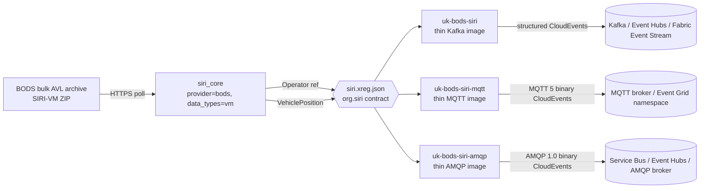

<!-- source-hero:begin -->

<table width="100%"><tr>
<td width="80" valign="middle" align="center">

<br>

<sub><b>United Kingdom</b></sub>

</td>

<td valign="middle">

# UK BODS SIRI

<sub>England bus AVL · BODS SIRI-VM · config-only wrapper over <code>siri</code> · <a href="https://www.bus-data.dft.gov.uk/">upstream</a> · <a href="https://data.bus-data.dft.gov.uk/avl/download/bulk_archive">bulk archive</a></sub>

  

&nbsp;

  

> England — BODS bulk AVL VehicleMonitoring via the generalized `siri` feeder

[🚀 **Deploy to Azure**](https://clemensv.github.io/real-time-sources#uk-bods-siri) &nbsp;·&nbsp;

[📓 **Fabric Notebook**](https://clemensv.github.io/real-time-sources#uk-bods-siri/fabric-notebook) &nbsp;·&nbsp;

[🐳 **docker pull**](CONTAINER.md) &nbsp;·&nbsp;

[📑 **Event schemas**](EVENTS.md) &nbsp;·&nbsp;

[🗄️ **KQL schema**](kql/uk-bods-siri.kql) &nbsp;·&nbsp;

[↗ **Upstream**](https://www.bus-data.dft.gov.uk/)

</td></tr></table>

<!-- source-hero:end -->

## At a glance

<table align="right">
<tr><td valign="middle">🌍</td><td valign="middle"><b>Region</b></td><td valign="middle">England</td></tr>
<tr><td valign="middle">🏛️</td><td valign="middle"><b>Authority</b></td><td valign="middle"><a href="https://www.gov.uk/government/organisations/department-for-transport">UK Department for Transport</a></td></tr>
<tr><td valign="middle">📊</td><td valign="middle"><b>Coverage</b></td><td valign="middle">Bus Open Data Service AVL bulk archive</td></tr>
<tr><td valign="middle">⏱️</td><td valign="middle"><b>Cadence</b></td><td valign="middle">30-second default poll; restart-safe dedupe state</td></tr>
<tr><td valign="middle">🔌</td><td valign="middle"><b>Transports</b></td><td valign="middle">Kafka · MQTT 5.0 · AMQP 1.0</td></tr>
<tr><td valign="middle">📍</td><td valign="middle"><b>Kafka key</b></td><td valign="middle"><code>{operator_ref}</code> or <code>{operator_ref}/{vehicle_ref}</code></td></tr>
<tr><td valign="middle">📦</td><td valign="middle"><b>Events</b></td><td valign="middle"><code>org.siri.Operator</code> · <code>org.siri.VehiclePosition</code></td></tr>
<tr><td valign="middle">🔐</td><td valign="middle"><b>Auth</b></td><td valign="middle">BODS API key optional for the public bulk archive; supported as <code>SIRI_API_KEY</code> or <code>BODS_API_KEY</code></td></tr>
</table>

`uk-bods-siri` is now a **configuration-only thin wrapper** around the generalized [`siri`](../siri/README.md) feeder. The source-specific folder no longer owns parser code, producer code, or an xRegistry manifest. Its images simply inherit the maintained `siri` transport images and bake the non-secret BODS configuration:

```text
SIRI_PROVIDER=bods
SIRI_DATA_TYPES=vm
```

At runtime, the generalized feeder uses `siri_core.config.DEFAULT_BODS_URL` (`https://data.bus-data.dft.gov.uk/avl/download/bulk_archive`) unless `SIRI_URL` is supplied. `SIRI_API_KEY` and the legacy-compatible `BODS_API_KEY` are both accepted; never bake either into an image.

> [!IMPORTANT]

> **Contract change.** Earlier `uk-bods-siri` images emitted bespoke `uk.gov.dft.bods.Operator` and `uk.gov.dft.bods.VehiclePosition` events. This thin wrapper emits the generalized `siri` contract: `org.siri.Operator` and `org.siri.VehiclePosition`, with the schemas, CloudEvents `source`, `subject`, Kafka keys, MQTT topics, and AMQP properties documented in [EVENTS.md](EVENTS.md).

## 60-second quick start

```bash
docker run --rm \
  -v "$PWD/state:/state" \
  -e STATE_FILE=/state/uk-bods-siri.json \
  -e SIRI_API_KEY="<bods-api-key>" \
  -e CONNECTION_STRING="Endpoint=sb://<ns>.servicebus.windows.net/;SharedAccessKeyName=...;SharedAccessKey=...;EntityPath=uk-bods-siri" \
  ghcr.io/clemensv/real-time-sources-uk-bods-siri:latest
```

The first cycle emits `org.siri.Operator` reference records for operators observed in the BODS payload and `org.siri.VehiclePosition` telemetry for changed vehicles. Mount `STATE_FILE` to persist dedupe state across restarts.

## Architecture



All runtime behavior lives in `feeders/siri/`. This folder preserves the BODS deployment identity, documentation, catalog entry, Azure templates, Fabric notebook, and KQL script while avoiding another fork of the SIRI parser and producers.

## Configuration
| Setting | Environment | Default in thin wrapper | Notes |
| --- | --- | --- | --- |
| Provider | `SIRI_PROVIDER` | `bods` | Baked into all thin images. |
| Data types | `SIRI_DATA_TYPES` | `vm` | BODS fold-in emits VehicleMonitoring payloads. |
| Source URL | `SIRI_URL` | generalized feeder BODS bulk archive default | Override only when using another BODS-compatible endpoint. |
| API key | `SIRI_API_KEY` or `BODS_API_KEY` | none | Runtime secret; never baked. |
| Operator filter | `SIRI_OPERATORS` or `OPERATORS` | empty | Optional comma-separated operator filter. |
| Poll cadence | `POLLING_INTERVAL` | `30` | Seconds between polls. |
| Dedupe state | `STATE_FILE` | `~/.siri_state.json` in the base image | Mount a volume for persistent state. |
| One-shot mode | `ONCE_MODE` | false | Used by Docker E2E and scheduled notebook runs. |
## Event contract

Read [EVENTS.md](EVENTS.md) for the full CloudEvents contract and [kql/uk-bods-siri.kql](kql/uk-bods-siri.kql) for the Fabric Eventhouse / ADX schema. The table names are intentionally `org.siri.*` because the on-wire event types now come from the generalized SIRI contract.

## Container and deployment details

The published image and Azure deployment contract is in [CONTAINER.md](CONTAINER.md). Use this source-specific image when you want the BODS defaults baked in; use [`siri`](../siri/README.md) directly when you want to configure another SIRI-compatible provider.

