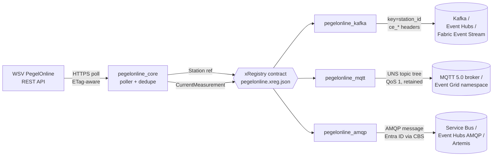

<!-- source-hero:begin -->
<table width="100%"><tr>
<td width="80" valign="middle" align="center">
<br>
<sub><b>🇩🇪 Germany</b></sub>
</td>
<td valign="middle">

# Pegelonline — German Federal Waterways Hydrology

<sub><b>WSV PegelOnline</b> · ~1,200 federal gauges · polled every 60 s · <a href="https://www.pegelonline.wsv.de/">upstream</a> · <a href="https://www.pegelonline.wsv.de/webservice/dokuRestapi">REST API docs</a></sub>


&nbsp;


&nbsp;
<a href="https://github.com/clemensv/real-time-sources/actions/workflows/build_containers.yml"></a>

> **Real-time water-level CloudEvents for every federally administered inland and coastal gauge in Germany** — Rhine, Elbe, Danube, Weser, Main, Mosel, Oder, Kiel Canal. Reference station catalog + live measurements, keyed by `{station_id}`, identical schemas across Kafka, MQTT 5.0 (UNS), and AMQP 1.0.

[🚀 **Deploy to Azure**](https://clemensv.github.io/real-time-sources/#pegelonline) &nbsp;·&nbsp;
[📓 **Fabric Notebook**](https://clemensv.github.io/real-time-sources/#pegelonline/fabric-notebook) &nbsp;·&nbsp;
[🐳 **docker pull**](CONTAINER.md) &nbsp;·&nbsp;
[📑 **Event schemas**](EVENTS.md) &nbsp;·&nbsp;
[🗄️ **KQL schema**](kql/pegelonline.kql) &nbsp;·&nbsp;
[🗺️ **Fabric Map**](fabric/README.md)

</td></tr></table>
<!-- source-hero:end -->

## At a glance

<table align="right">
<tr><td valign="middle">🌍</td><td valign="middle"><b>Region</b></td><td valign="middle">🇩🇪 Germany (federal waterways)</td></tr>
<tr><td valign="middle">🏛️</td><td valign="middle"><b>Authority</b></td><td valign="middle"><a href="https://www.wsv.bund.de/">Wasserstraßen- und Schifffahrtsverwaltung des Bundes (WSV)</a></td></tr>
<tr><td valign="middle">📊</td><td valign="middle"><b>Coverage</b></td><td valign="middle">~1,200 stations on rivers, canals, estuaries</td></tr>
<tr><td valign="middle">⏱️</td><td valign="middle"><b>Cadence</b></td><td valign="middle">15-minute upstream sampling, 60-second poll</td></tr>
<tr><td valign="middle">🔌</td><td valign="middle"><b>Transports</b></td><td valign="middle">Kafka · MQTT 5.0 · AMQP 1.0</td></tr>
<tr><td valign="middle">📍</td><td valign="middle"><b>Kafka key</b></td><td valign="middle"><code>{station_id}</code></td></tr>
<tr><td valign="middle">📦</td><td valign="middle"><b>Events</b></td><td valign="middle"><code>Station</code> · <code>CurrentMeasurement</code></td></tr>
<tr><td valign="middle">📜</td><td valign="middle"><b>License</b></td><td valign="middle"><a href="https://www.govdata.de/dl-de/by-2-0">DL-DE→BY 2.0</a> (open)</td></tr>
<tr><td valign="middle">🔐</td><td valign="middle"><b>Auth</b></td><td valign="middle">None — public REST</td></tr>
</table>

The bridge turns the German [WSV PegelOnline](https://www.pegelonline.wsv.de/)
REST API into a real-time CloudEvents stream that consumers can subscribe to
instead of polling REST themselves. It handles the boring parts — ETag-aware
polling, per-station dedupe state, JsonStructure-validated payloads, identity
plumbing, retries — and ships as three drop-in transport variants.

**Who uses it.** Flood early-warning and civil protection (react to rising
gauges within one poll cycle across a basin); inland shipping operations
(Rhine, Mosel, Elbe fairway-depth thresholds at Kaub, Maxau, Emmerich, …);
hydropower and water-management dispatch (intraday market bidding with
up-to-the-minute headwater/tailwater); environmental compliance and research
(long-running dedupe-aware ingestion into Fabric Eventhouse / ADX / lakes);
insurance and risk (parametric flood triggers, live exposure dashboards).

## 60-second quick start

```bash
docker run --rm \
  -v "$PWD/state:/state" \
  -e STATE_FILE=/state/pegelonline.json \
  -e CONNECTION_STRING="Endpoint=sb://<ns>.servicebus.windows.net/;SharedAccessKeyName=...;SharedAccessKey=...;EntityPath=pegelonline" \
  ghcr.io/clemensv/real-time-sources-pegelonline-kafka:latest
```

That's it. The first cycle emits ~1,200 `Station` reference events; every
subsequent 60 s cycle emits only the gauges with new measurements (typically
~50–200 events). Mount `./state` to persist dedupe across restarts.

MQTT and AMQP variants take the same form — see
[CONTAINER.md](CONTAINER.md) for the per-transport env-var matrix.

## Architecture



All three variants share the upstream poller (`pegelonline_core`), the
xRegistry contract (`xreg/pegelonline.xreg.json`), and the CloudEvents
schemas — switching transport never changes the data model.

## Sample event

<details>
<summary><b><code>de.wsv.pegelonline.CurrentMeasurement</code></b> — live water-level reading (click to expand)</summary>

```json
{
  "specversion": "1.0",
  "type": "de.wsv.pegelonline.CurrentMeasurement",
  "source": "https://www.pegelonline.wsv.de/webservices/rest-api/v2",
  "id": "01985f6c-2f55-7c4f-9d2a-3a8e64c4e2a1",
  "time": "2026-05-27T07:30:00Z",
  "subject": "stations/MAXAU/water-level",
  "datacontenttype": "application/json",
  "data": {
    "station_id": "MAXAU",
    "station_uuid": "85d52e5a-d92a-4d97-8d62-cf2b91d6f0ff",
    "water_shortname": "RHEIN",
    "timestamp": "2026-05-27T07:30:00+02:00",
    "value": 482.0,
    "unit": "cm",
    "state_mnw": "above",
    "state_mhw": "below",
    "trend": 1
  }
}
```

The Kafka record carries the same JSON in the value, the CloudEvents
attributes as `ce_*` headers (binary content mode), and the Kafka key
set to `MAXAU` (the `{station_id}` template). On MQTT the same JSON
is published to `hydro/de/wsv/pegelonline/RHEIN/MAXAU/water-level`
(QoS 1, retained, CloudEvents attributes as MQTT 5 user properties).
On AMQP the same JSON is the application body with the CloudEvents
attributes as `cloudEvents:*` application properties.

See [EVENTS.md](EVENTS.md) for the full schemas of both event types
(`Station` and `CurrentMeasurement`) and the JsonStructure constraints.

</details>

## Transport variants

| Variant | Container image | Targets | Wire shape |
|---|---|---|---|
| **🟥 Kafka** | `ghcr.io/clemensv/real-time-sources-pegelonline-kafka` | Apache Kafka 2.x · Azure Event Hubs · Fabric Event Streams · Confluent · Redpanda · Aiven · MSK | Single topic, binary CloudEvents (`ce_*` headers), key = `{station_id}` |
| **🟪 MQTT** | `ghcr.io/clemensv/real-time-sources-pegelonline-mqtt` | Mosquitto · EMQX · HiveMQ · Azure Event Grid namespace · Fabric Real-Time Hub MQTT broker | UNS tree `hydro/de/wsv/pegelonline/{water}/{station}/...`, QoS 1, retained, CloudEvents as MQTT 5 user properties |
| **🟦 AMQP** | `ghcr.io/clemensv/real-time-sources-pegelonline-amqp` | Azure Service Bus · Azure Event Hubs (AMQP surface) · ActiveMQ Artemis · Qpid · RabbitMQ AMQP 1.0 plugin | Single AMQP node, binary CloudEvents, SASL PLAIN or Entra ID via AMQP CBS (no SAS-key rotation) |

## Deploy

| Target | One-click | Best for |
|---|---|---|
| **Azure → Event Hubs (Kafka)** | [🚀 Portal](https://clemensv.github.io/real-time-sources/#pegelonline) | Greenfield Azure deployments wanting Kafka semantics |
| **Azure → Service Bus (AMQP, Entra ID)** | [🚀 Portal](https://clemensv.github.io/real-time-sources/#pegelonline) | Existing Service Bus topologies, no SAS-key minting |
| **Azure → Event Grid namespace (MQTT)** | [🚀 Portal](https://clemensv.github.io/real-time-sources/#pegelonline) | UNS / industrial IoT topologies |
| **Azure → Fabric Event Stream** | [🚀 Portal](https://clemensv.github.io/real-time-sources/#pegelonline) | Direct ingest into Fabric Eventhouse |
| **Fabric Notebook (no Azure subscription)** | [📓 Portal](https://clemensv.github.io/real-time-sources/#pegelonline/fabric-notebook) | Low-volume polling fully inside Fabric. Recommended for the default 60 s cadence — the notebook runs on Fabric schedule, dedupe state lives in OneLake, no container host to manage |
| **Self-hosted (laptop, k8s, ACA, Cloud Run, ECS)** | [🐳 CONTAINER.md](CONTAINER.md) | Anything else |

The portal buttons wrap `tools/deploy-fabric/deploy-feeder-notebook.ps1`
(notebook) or the ARM templates in this directory (ACI). Both routes
end up writing to the same KQL update policies from
[`kql/pegelonline.kql`](kql/pegelonline.kql); a Fabric Eventhouse is
created if it doesn't already exist.

## Configuration

<details>
<summary>Full environment-variable reference (click to expand)</summary>

| Variable | Variant | Purpose | Default |
|---|---|---|---|
| `CONNECTION_STRING` | Kafka | Kafka 2.x SASL/PLAIN over TLS, or Azure Event Hubs / Fabric Event Stream connection string | required |
| `MQTT_BROKER_URL` | MQTT | `mqtts://host:8883` or `mqtt://host:1883` | required |
| `MQTT_USERNAME` / `MQTT_PASSWORD` | MQTT | Username/password for SASL or Event Grid SAS | optional |
| `MQTT_AAD_*` | MQTT | Entra ID JWT enhanced auth for Event Grid namespace | optional |
| `AMQP_BROKER_URL` | AMQP | `amqp[s]://[user[:pass]@]host[:port]/<entity>` | required (or Entra/CBS env) |
| `AMQP_CBS_*` | AMQP | Entra ID for Service Bus / Event Hubs CBS put-token | optional |
| `STATE_FILE` | all | Path to dedupe state file (mount a volume!) | `/state/pegelonline.json` |
| `POLL_INTERVAL_SECONDS` | all | Upstream poll cadence | `60` |
| `STATIONS_REFRESH_SECONDS` | all | Station-catalog re-emit cadence | `3600` |
| `ONCE` | all | Run a single poll cycle and exit (for cron/Fabric notebook) | `false` |
| `LOG_LEVEL` | all | `DEBUG` / `INFO` / `WARNING` / `ERROR` | `INFO` |

The full per-deployment-shape env-var matrix (Entra ID via CBS or
OAUTH2-JWT, SAS-token CBS, Service Bus emulator, etc.) lives in
[CONTAINER.md](CONTAINER.md). The runtime entry point for every image
is `python -m pegelonline_{kafka,mqtt,amqp} feed`; the image's default
`CMD` invokes it for you.

</details>

## Data model

Two event types, both in message group `de.wsv.pegelonline`:

- **`Station`** — reference event, emitted at startup and refreshed every
  `STATIONS_REFRESH_SECONDS`. Carries the station identity, river/water
  body name, geo coordinates, gauge zero / PNP datum, and the long-name
  used by WSV publications. Subject: `stations/{station_id}/info`.
- **`CurrentMeasurement`** — telemetry event, emitted per gauge per poll
  cycle whenever the upstream value or timestamp has changed. Carries
  the timestamp, value, unit, trend, and threshold-state flags
  (above/below MNW, MHW, etc.). Subject: `stations/{station_id}/water-level`.

Both events are keyed by `{station_id}` so a consumer joining a
`Station`-keyed KTable with a `CurrentMeasurement`-keyed stream always
sees the temporally consistent station metadata for each measurement —
see [Streamifying reference data for temporal consistency with
telemetry events](https://vasters.com/clemens/2024/10/30/streamifying-reference-data-for-temporal-consistency-with-telemetry-events)
for the design rationale.

The complete JsonStructure schemas (with units, validation constraints,
and Avro round-trip) are in [EVENTS.md](EVENTS.md).

## Repository layout

```text
pegelonline/
├── xreg/pegelonline.xreg.json     # shared xRegistry contract
├── pegelonline_core/              # transport-agnostic poller
├── pegelonline_kafka/             # Kafka feeder application
├── pegelonline_mqtt/              # MQTT/UNS feeder application
├── pegelonline_amqp/              # AMQP 1.0 feeder application
├── pegelonline_producer/          # xRegistry-generated Kafka producer
├── pegelonline_mqtt_producer/     # xRegistry-generated MQTT producer
├── pegelonline_amqp_producer/     # xRegistry-generated AMQP producer
├── kql/pegelonline.kql            # Eventhouse table + update policies
├── notebook/pegelonline-feed.ipynb # Fabric Notebook feeder
├── fabric/                        # 8-layer Fabric Map
├── Dockerfile.kafka               # builds the Kafka feeder image
├── Dockerfile.mqtt                # builds the MQTT feeder image
├── Dockerfile.amqp                # builds the AMQP feeder image
└── tests/                         # unit + integration tests
```

## Prerequisites (for self-hosted runs)

- Docker 20.10+ (or any OCI-compatible runtime).
- Outbound HTTPS to `pegelonline.wsv.de` — no credentials required.
- Network access to your target Kafka broker, MQTT broker, or AMQP 1.0 peer.
- A writable host directory mounted at `/state` so dedupe state survives
  restarts. **Without it, dedupe restarts cold on every container start.**

---

<sub>
📚 <a href="../README.md">← Back to catalog</a> &nbsp;·&nbsp;
🌐 <a href="https://clemensv.github.io/real-time-sources/#pegelonline">Portal entry</a> &nbsp;·&nbsp;
📑 <a href="EVENTS.md">EVENTS.md</a> &nbsp;·&nbsp;
🐳 <a href="CONTAINER.md">CONTAINER.md</a> &nbsp;·&nbsp;
🗄️ <a href="kql/pegelonline.kql">KQL schema</a> &nbsp;·&nbsp;
🗺️ <a href="fabric/README.md">Fabric Map</a> &nbsp;·&nbsp;
↗ <a href="https://www.pegelonline.wsv.de/">pegelonline.wsv.de</a> &nbsp;·&nbsp;
📖 <a href="https://www.pegelonline.wsv.de/webservice/dokuRestapi">REST API docs</a>
</sub>
